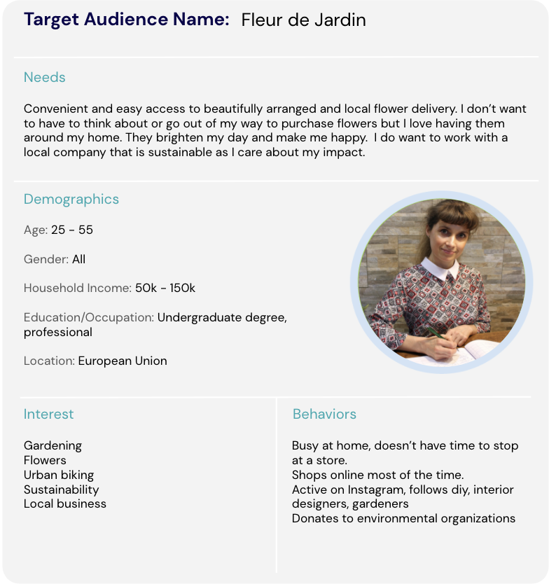

# Target Audience Worksheet

- It's time to put into practice everything you've learned about defining your Target Audience. Review your business description, SMART Goal, and KPIs from previous worksheets before diving into creating your target audience. Feel free to update your work so far to reflect your new learning.

- In this worksheet, you will define and create a customer persona for your target audience. The persona should describe a made up composite person representing your target audience for the product or service being offered by the business you selected. Make sure you complete every part of the target audience worksheet so you have a well rounded persona, including:

  - Target audience name and image: What name and image represents your target audience and can be used throughout the template? Often a play on something related to your selected business is ideal as it keeps the goal of the persona top of mind.

  - Needs: What is your target audience’s need or needs that your selected business directly serves

  - Demographics: What key statistical data describes your target audience including: age, gender, household income, education/occupation, and location?
  - Interests: What interests do your target audience share that could potentially relate to your business in some way?
  - Behaviors: What behaviors does your target audience engage in on a regular basis that your selected business can use to reach out or that relates to the business product or service?

- Open and complete the Target Audience worksheet: There are two options to access the Target Audience worksheet.

  1. Download a PowerPoint version of the worksheet by clicking here.
  2. Make a copy of the template by clicking here, then clicking the Make a copy button. You will need to be signed in to a Google account in order to make a copy of the worksheet.

- Example of a Target Audience persona:

Short Business Description
Name: Calla & Ivy

- Description of the business: We are a B2C flower business located in Amsterdam, NL. We provide flower subscriptions and flower bouquets that can be ordered online and shipped throughout Europe. We are launching a new product: a monthly subscription box combining flowers and plants with DIY craft projects such as seasonal wreaths.

SMART Goal
Achieve 50 subscriptions in the first month with my new product online: a monthly subscription box combining flowers and plants with DIY craft projects such as seasonal wreaths. Based on the trend in the number of subscribers we currently have, we believe we can achieve 50 subscriptions.

KPIs
Subscriptions/sales - our goal is to have 50 subscribers to our new subscription product; therefore, we need to track our sales to ensure we are on track for the end of the month.
Website traffic to new product page - we know the likelihood of customers subscribing will increase the more we send to the new product page.
Conversion rate - we need to understand how many of the number of people coming to the site are actually subscribing so we can optimize the landing page or the traffic coming to the site.
Target Audience

