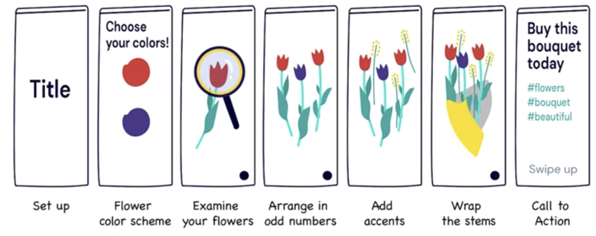

## Topics to Post About

- **Content From Your Website**
  - Blog post, article, podcast, include the link,
  - Eg. Article on applying for job...: "You Don't Need to Meet Every Qualification to Apply for a Job"
- **Behind-The_scenes**

* eg. Video during harvest time
* Feature Employees
* Upcoming Events - good at FB
* Holidays or Special Events
* Tutorials - for product or service
* Ask a Question
* Giveaway or Contest
* Content Around Popular Hashtags - Like Motivational Monday
* Reoprts and Whitepapers
* Relate to Trends - eg. BLM, Election, war
* Inspirational Quotes "Being extraordinary is weired to those who are ordinary."
* Showcase Customers. eg Customer of the week or months to share their experience. Picure of the customer using your product

* Partnering with Influencers
* New Product Introductions
* Humor:
* Pop Culture
* Curated Content
* User Generated Content
* Repurpose Content - Older content. eg as Top 10 list posts
* Cause or Charity
* Thank your audience: Promo Code as a thank you gift
* Sell Products or Services. With the link to purcahse it.

- etc

On your own, come up with a specific post for each of the following, based on your own business, one you know about, or a made-up business (write down a description, or sketch it out):

- Behind-the-scenes
- A post referencing pop culture
- A Throwback Thursday
- A customer showcase
- An inspirational quote

## Using Storyboards to Plan Your Content

- A storyboard is simply a visual outline of your story, sketched across a series of blocks or boxes arranged in order of the story you want to tell.
- Good for video post on Instagram or FB

## Creating a Storyboard

1. What are our engagement goals?
   - educate
   - increase traffic
   - make sale
2. What story are we going to tell?

## Storyboard Benefits

1. Brainstorm
2. Visualize
3. Create great content
4. Remember key elements
5. Collaboration
6. Templating

## What Makes Content Viral?

- **Six Things to Do to Help You Go Viral**

  1. Create "social currency" content

  - Increase people's social currency when they share them. Most people on social media want to seem smart, cultured and ethical. You should give them content that helps them do that.

  2. Use a sensory "trigger"

  - This is something that makes people immediately think of your product when they see, hear, smell, or touch it. "Just do it"

  3. Evoke emotion

  - Evoking strong emotion is also an excellent way to go viral. The emotion could be happiness, sadness, or even anger. A good example of this is Johnnie Walker's 2015 Dear Brother ad.

  4. Make your brand as public as possible

  - use your unique logo

  5. Make your content practical

  - content that is practical or immedatly usful

  6. Tell a story

  ## Using a Content Calendar

  - A Calendar where you fill in upcoming events for your social media platforms, when they're going to be posted and where.

  * **Customer Engagement**

    - Furthers your brand
    - Increase trust
    - Provides something of value for your followers
    - Turn followers into fans

    * **Benefits of Having a Content Calendar:**

    1. Organization
    2. Consistent brand voice
    3. Plan for events or holidays
    4. Fill in the gaps
    5. Collaboration across the team

    - **Questions to Ask When Deciding on Content:**

    * What are your goals?
    * Who is your audience?
    * What does the customer journey look like?
    *

    - **Content Calendar Includes:**

    * Content you are sharing with your audience
    * Which platform and format?
    * Date and time

* **NB The best content calendar is the one you actually use!**

### Creating a Content Calendar

- Open a google sheet
- name it Content ideas
- Cols hearders:

  - Informational
    - Recent blog post #1
    - Recent blog post #2
    - Recent blog post #3
    - Outside articles# 1
    - Outside articles# 2
    - Outside articles# 3
    - Outside articles# 4
  - Inspirational

    - Client pet #1
    - Client pet #1
    - Nursing home visit

    * Hashtags to use
      - #Motivational Monday?

  - Fun?Entertaining

    - Clips from the shop
    - Clips from clients

    * Hashtags to use
      - #Throwback Thursday?

  - Business
    - Promote new email newsletter
    - upcomimg mobile app update

- Open another sheet and name it Calendar
  -

### Post Frequency:

- Facebook: 1 per day
- Twitter: 15 per day
- Pinterest: 11 per day
- Instagram: 1-2 per day

### 3 things to Remember:

    1. Posts should be consistent and frequent
    2.  Posts may be Curated
    3. Posts can be repurposed
