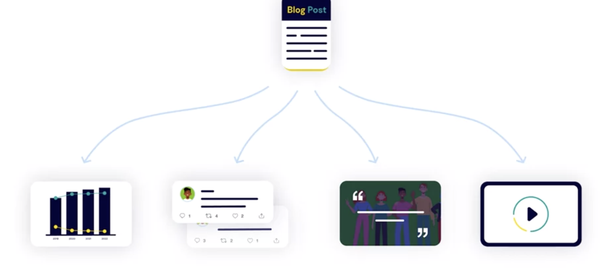

# Effectively Creating and Producing Content

### Repurposing Content

- Repurposing content is simply the idea that no piece of content is ever, "One and done."
  

* **What Content Should You Repurpose?**

1. Evergreen content
   - A how-to guide
   - A report
   - An overview of a certain topic or industry
2. Non-Evergreen

- Timely or time-stamped content
- Content that responded to a trend or a news cycle

2. Popular content

-

### Benefits to Repurposing Content

1. Stretches the value
2. Play to platform's strength
3. Expand your audience
4. Reinforce your message
5. More social media posts
6. Position as an authority
7. Audience format preference
8. Search Engine Optimization (SEO) advantages
9. Saves you time

## Auditing Content

- There's an old saying, "Nothing succeeds like success" from TV shows to cars to coffee. If a product is a hit with your audience, you'll want to try to replicate what you did to capture that success again.

- An audit is simply a detailed list of what content you have and the engagement metrics associated with each piece of content.

### Benefits of a Content Audit:

- Better oversight
- Identify valuable content
- Find trends in engagement
- Make improvements
- Assess target audience fit
- See the template
- use google analaytics
- No. of Visit, no. of visitor, and time spant on the page are good indicators
