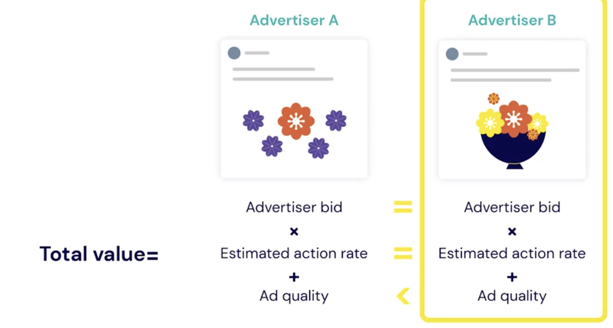

# First Steps in Facebook Ads Manager Overview

## Weekly Overview:

1. Tools to Advertise on Facebook
2. Ad Placements
3. The Facebook Ad Auction

## Next

1. Campaign Structure
2. Set up Your Ad Account
3. How to Navigate Ads Manager

## Tools to Advertise on Facebook

- 2 main tools:

1. Promote from page
2. Ads Manager (app or web)

### 1. Promote from page

- **Creating Ads Using The `Promote` Button** has 3 steps process.
- Click `Promote` button
- `Choose a Goal`
- The provide `Ad Creative`, `Copy` , `CTA` button and the `url` of your landing pange.
- Then, `Target Audience`
- `Daily Budget` and `Duration`
- Finally hit `Promote Now`

### 2. Ads Manager (app or web)

- **Facebook Ads Manager App Functionlity**

* Create ad campaigns
* Manage campaigns
* See results for your campaigns
* Manage campaigns from multiple business pages

- **Facebook Ads Manager Web Functionality**

* Create and manage ad campaigns
* Choose ad objectives, creative options, and placements
* Save ads as drafts
* Access to all Facebook's advanced tools
* To access go to the following link

[FacebookAdsManager](facebook.com/ads/manage)

- **Creating Ads Using Ads Manager:-**
- Click `Create` button
- `Choose a Campaign Objective`
- Choose `Traffic`
- `Adience`: Location, Age, Gender, Target Detailed, Languages
- `Budget and Schedule`
- `Placement`: Facebook, Messenger, Instagram, Audience Network.
- Choose How you want your Ad to work. `Format` or `Add an Instant Experience`
- `Payment Information`

### Ad Placements

- Facebook
- Instagram
- Messenger
- WhatsApp
- Audience Network

* `Placements`: Under Ad Manager, if you choose `Automatic Placements`, Facebook will place your in multiple place.

- Most of the time this choice is good
- You can also choose `Manual Placement`

#### Facebook's Major Ad Placemnt Types:

- Feeds
- Stories
- In-Stream
- Search
- Messages
- In-Article
- Apps

- **Feeds:** Has 7 placements

1. Facebook News Feed plaement
2. Instagram Feed placement
3. Facebook Marketplace placement
4. Facebook Video placement
5. Facebook Right Column placemnet
6. Instagram Explore placemnt
7. Facebook Messenger Inbox placement

- **Stories**
- Story Ad Placemnt- on Facebook, Messenger and Instagram.
- **In-Stream**
- Your ads will appear on video on demand and in a select group of approved partner livestreams on Facebook. Your ads can appear before, during, or after video content. In-stream ads are currently only available on Facebook.

- **Search**
- on Facebook and Facebook market place if someone search for related product.

- **Messages**
- If you choose this placement, your ads will appear as messages to people who've had an existing conversation with you in Messenger.
- **In-Article**
- Facebook instant article placement. Now, this means that your ads will appear in some articles on the Facebook mobile app.

- **Apps:-**
- Aduience Network Ad placement
- **Four** Types of App Ad Placements:-

1. Native ad placement
2. Banner ad placement
3. Interstitial ad placement
4. Rewarded video ad placement

## The Facebook Ad Auction

- How Facebook decides how much to charge for an ad.
- It has two goals:

1. Create value for advertisers
2. Provide positve user experience

- > Match the right ad to the right person at the right time.
- Example

* **Advertiser A**

- Targets all women who like flowers

* **Advertiser B**

- Targets all people who like flowers and live in California.

- And let's call this woman Clara. So how does Facebook decide whose ad Clara sees? Well, Facebook decides which ad Clara sees by running an equation that calculates a total value for each of these ads, which is effectively a numerical score

- **Ad with higher total value win the Auction and get show up to Clara**

#### Total Value:

- `Advertiser bid X Estimated action rate + Ad quality = Total Value`

- **Advertiser bid:-** How much an advertiser is willing to pay for an outcome.
- **Estimated action rate:-** Likelihood that a certain ad shown to a certain person willing to lead to a desired outcome. eg Click on Shop Now, Learn More...

- **Ad quality:-** Quality of an ad based on many variables.

[Quiz](https://www.coursera.org/learn/advertising-with-facebook/quiz/Zu8IK/introduction-to-ads-manager-practice-quiz/attempt?redirectToCover=true)

### How Faceboo Charges for Ads:

1.  Per 1,000 impressions (CPM) -Cost Per Thousand

- CPM = (Total amount spent/Impression) X 1,000
- ($50/10,000)X 1,000 = $5
- Use to determine the cost - effectiveness of advrtisment.

2. Per link click
3. Per action eg. watching a video

## Ad Budget

- The total amount you want to spend daily, or over the course of the campaign.

### How You will Pay Facebook for Ads:-

1. Automatic payments

- Automatically charged
- Charged each time you hit your billing threshold
- On Monthly bill date: any leftover charges.

2. Manual paymnets

- Preload money to your account.
- Facebook deducts as your ads run.
