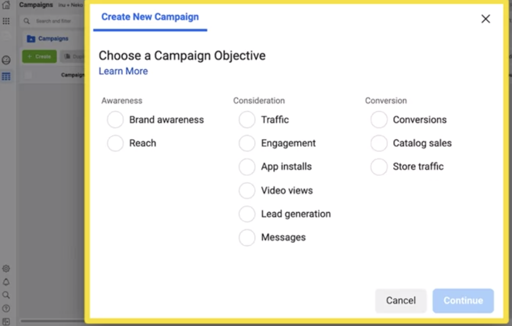
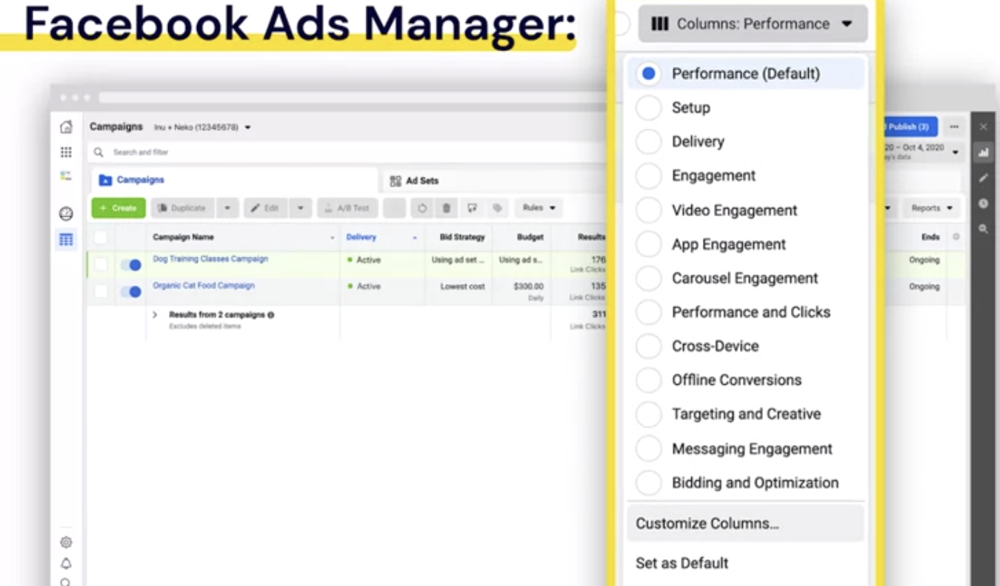
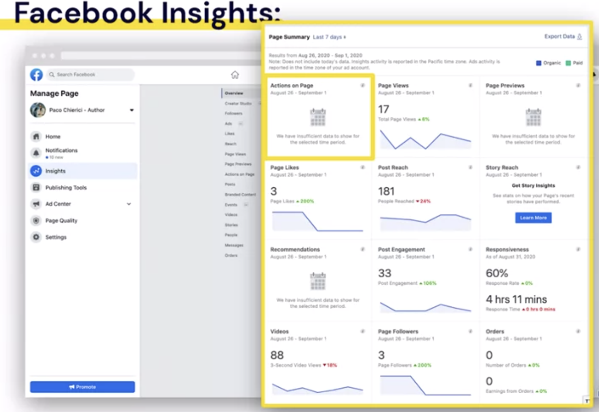

## Measure and Optimize Social Media Marketing Campaigns Course Introduction

- **Week 1- Evaluate Your Marketing Results Against Goals**
  1. Defining the Metrics
  2. Measuring Marketing Outcomes
- **Week 2- Measure Your Advertising Effectiveness**
  1. Introduction to Advertising Effectiveness Measurements
  2. Experiements to measure Ad Effectiveness on Facebook
- **Week 3- Optimize Your Ad Campaigns**
  1. Optimize Within a Campaign With A/B Testing
  2. Optimize Advertising Across Channels
- **Week 4- Communicate Your Marketing Results**
  1. Telling Your Full Campaign Story
  2. Presenting with Data

### Measure and Optimize Social Media Marketing Campaigns Overview

- By the end of each week you will be able to:

* **Week 1: Evaluate Your Marketing Results Against Goals**

  - Align metrics with common marketing goals
  - Understand data and reports used for marketing measurement
  - Define common metrics: ROAS, ROI, Cost per Result, LTV
  - Calculate common marketing metrics

* **Week 2: Measure Your Advertising Effectiveness**

  - Understand what questions to ask when measuring your marketing effectiveness
  - Understand experiments and how they can help measure advertising effectiveness
  - Explain methods to assess advertising effectiveness using experiments on Facebook
  - Understand the role of the Facebook Pixel, SDK and Conversion API in measurement

* **Week 3: Optimize Your Ad Campaigns**

  - Explain how to implement an A/B test to optimize your campaign
  - Understand how to assess advertising effectiveness across channels

* **Week 4: Communicate Your Marketing Results**

  - Outline what campaign information needs to be shared
  - Tell the story of your marketing effort supported by data in a concise presentation
  - Draw conclusions and formulate next steps based on your findings
  - Extract and visualize the right data to tell your story

## Evaluate Your Marketing Results Against Goals Overview

1. Establishing which metrics can help you evaluate your results
2. Where you can get the data to measure
3. How common marketing metrics are calculated.

## Align metrics with common marketing goals

- **Was the campaign successful?**
- **SMART Goals**: NB
  - Example:
  - **Goal**: 100 product sales in the month after launch.
  - **Goal**: 1Increase revenue by $20,000 over the next year.
  - **Goal**: Gain 1000 new followers by year's end.
- **Kep Performance Indicator (KPI)**: Metric you use to evaluate if you met your goal.
- **KPIs**: Should be:
  - Measurable
  - Directional
  - Relate to your goal
- **KPIs Categories:** 3
  - `Awareness`
    - Followers
    - Total Reach
    - Impressions
  - `Consideration`
    - Likes
    - Shares
    - Comments
    - Clicks
  - `Conversion` - App download - Buying a product

- Then, `Optimize the objective you have selected in the above step`: **Optimization and Delivery**

- **Example**

  - Increase sales: -> Conversion objective

- **DCB Cleaning**

  - **SMART goal:**

    - `Increase engagement on Facebook Page by 20% over next 3 months`
    - **KPIs:**
      - Likes, comments, shares
    - **Campaign Objective:**
      - Engagement
    - **Optimization:**
      - Post Engagemnet, Daily Unique Reach, or Impressions

  - **CALLA & IVY**
    - **SMART goal:**
      - `10,000 unique website visitors over the next month`
      - **KPIs:**
        - Website Traffic
      - **Campaign Objective:**
        - Traffic
      - **Optimization:**
        - Link Clicks, Landing Pange Views, Daily Unique Reach

## Data and Reports to Evaluate Performance

- **Analytics dashboards** will often allow you to customize the data you're looking at. So if you know that you want to track something very specific, like the sequence of pages a customer visits through a website. Or where they're entering from, you can set it up to give you data on just that. Again, you're seeking out answers to the questions you already formulated in advance.
- **Source of Data**

  1. `Facebook Ads Manger:`

  - At `Campaign Level`

    - Results | Reasch | Impressions | Cost per Result | Amount Spent

  - You can add more columns to show you more information

- Click `Customize Colunms`

2. `Facebook Insights:`

#### Aggregated Social Media Analytics:

- Examples:
  - Hootsuite
  - Buffer
  - Sprout Social
  - Sendible
  - SEMrush
  - CoSchedule

#### Social Media Advertising Analytics:

- Examples:
  - Qwaya
  - AdEspresso

#### Website Analytics:

- Examples:
  - Squarespace
  - Wix

#### Website Analytics with Google Analytics: Free
