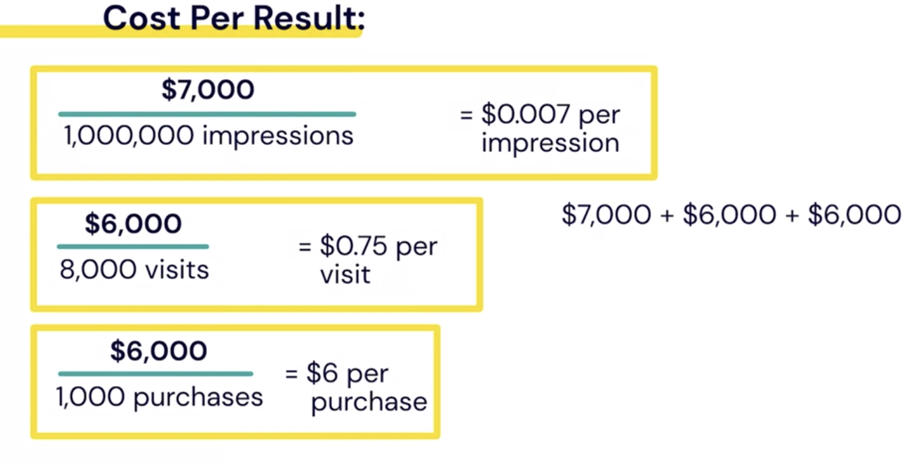
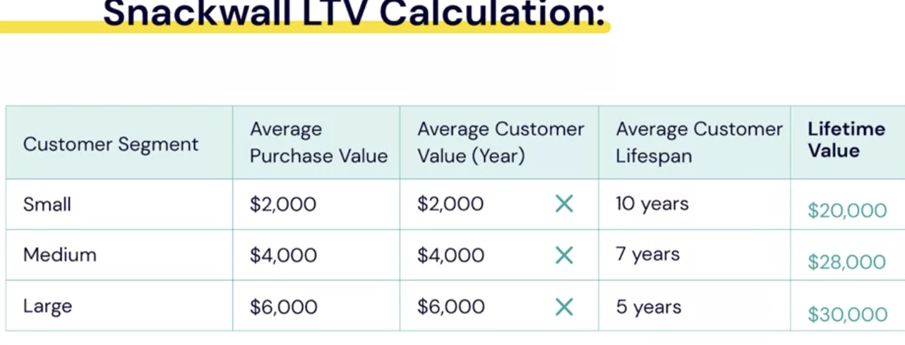

## Measuring Marketing Outcomes

### Understanding ROAS and ROI

- `"Was my campaign successful"?`
- `"Did my campaign pay off?"`

- **ROAS (Return on Ad Spend):**

  - ROAS is simply a way to find out how much revenue you made on your advertising versus what you spend on it
  - **ROAS = Revenue / Advertising Costs**
  - Example:

    - $1 ads -> $10 reveune
    - ROAS = $10/$1 = 10 -> ten times what you spend on ad.

    - $1 ads -> $2 reveune
    - ROAS = $10/$1 = 2 -> two times what you spend on ad.

  * **Why ROAS?**
    - Evaluate campaign effectiveness
    - ROAS should be higher than 1.
    - Set a target ROAS
    - Decide on future optimizations

* **CALLA & Ivy**: Example
  - `Calla & Ivy's Campaign`: advertising seasonal fall leaf wreaths.
  - $50 per piece
  - Ad Spend = $250
  - Quanity sold = 15
  - => revenue = $750
  - **ROAS = $750 / $250 = 3**

- **Where do you find such data?**
  - How do you know that Revenue came from certain campaign?
  - Facebook Pixel

* **DCB Cleaning**: Example

  - Leads Generation campaign.
  - Ad Spend = $2,000
  - Leads = 100
  - One lead = $2,000
  - He knew that: 10% of Lead convert: => 10% x 100 leads = 10 leads
  - => revenue = 10 leads X $2,000 = $20,000 revenue
  - **ROAS = $20,000 / $2,000 = 10**

* **Inu + Neko**: Example

  - `Campaign Types`:
    - Awareness campaigns
    - Consideration campaigns
    - Conversion campaigns
  - `Outcomes`

    - Impressions = 1,000,000
    - Website visits = 8,000
    - purchases = 1,000
    - Revenue = $30,000
    - Ad spend = $7,000 on awareness campaigns, $6,000 on consideration campaigns, and $6,000 on the conversion campaigns.
    - Ad spend = $19,000

    - **ROAS = $30,000 / $19,000 = 1.58**

* **ROAS vs ROI**

  - **ROAS** Revenue from a specific ad campaign
  - **ROI** Includes all costs, e.g. investments, advertising

* **CALLA & Ivy**: Example

  - `Calla & Ivy's Campaign`: advertising seasonal fall leaf wreaths.
  - $50 per piece
  - Ad Spend = $250
  - Quanity sold = 15
  - => revenue = $750
  - Cost to make = $500
  - **ROAS = $750 / $250 = 3**

  - Profit: $750 - ($500 + $250)= 0

* **ROI** `Return on Investment`
* ROI = (Revenue - Investments) / Investment

- `Investment = Ad spend + cost of goods sold`
- Investment = $500 + $250 = $750
- ROI = ($750 - $750) / $750 = 0 = ROAS

- Let say:
  - Sold = 200 wreaths
  - Investment(on making) = $800
  - $50 each
  - Total Revenue = $10,000
  - Investment = $800 + $2,000 = $2,800
  - **ROI = ($10,000 - $2,800) / $2,800 = 2.57**

* **To Improve ROAS:**
  1. Lower the cost of your ads
  2. Increase your revenue
     - Either lower the cost of your ads to get a better return, or increase the revenue you generate. Ideally, you could do both. You can do this by looking to see if you're `wasting time targeting the wrong audience`, or by not using the `right ad placements`. You may also have a bidding strategy that doesn't work for what you're trying to accomplish. You can also look at ways to simplify the buying experience once the customer gets to your website. In other words, make it easier for the user to take the action you want them to take. In our next videos, we'll go over more examples of how to calculate ROAS, and then move into other kinds of measurements, like customer lifetime value and cost per results.

## Understanding Cost per Result

- **Result = action we want people to take**-> Based on campaign objective. Based on goals.
- Example:
  - Traffic objective -> Landing Page Views
- **A Result Can Be:**:
  - A link click
  - A lead
  - An app install
  - Buying a product
  - Engagement with a post
  - An impression
  - A number of other actions
  - **Cost Per Result = Total amount spent / Number of results**
  - eg. $200 / 1,000 impressions = $0.20 per impression

* **But you need to know how many of these impressions convert**

* **Cost per Results Affected by:**
  - Auction bid
  - Audience settings
  - Optimizations
  - Ad placemnets
  - Schedule
  -
* Cost Per Result:

  - Demographic 1 < Demographic 2
  - Placement 1 > Placement 2
  - Schedule 1 < Schedule 2

* **Inu + Neko**: Example

  - `Campaign Types`:

    1. Awareness campaigns
       - $7,000/1,000,000 impressions = $0.007 per impression
    2. Consideration campaigns
       - $6,000/8,000 visit = $0.75 per visit
    3. Conversion campaigns

       - $6,000/1,000 purchases = $6 per purchase

       - If Average sale = $30
       - Return = $30 - $6 = $24

= $19,000/1,000 purchases = $19 cost per sale

- **Return on Investment (ROI)**
  - (Revenue - Cost of Investment) / Investments
- **Customer Acquistion Cost (CAC)**
- **Lifetime Value (LTV)**

* The great thing about Ads Manager is that it'll calculate a cost per result for you on your dashboard, so you can see how your campaign is doing, and if your cost per result is coming in too high. Ads Manager will also let you set a rule that will flag you if your cost per result is indeed coming in too high, so you can pause your campaign and re-adjust your settings. So as you're looking at evaluating how successful or how cost worthy your campaigns were, don't just use cost per result, but use it alongside the other metrics you've learned here like ROAS, ROI, customer acquisition cost, and lifetime value.

## Understanding Customer Lifetime Value

- **Customer Acquistion Cost (CAC)**:
  Total marketing cost to get one new customer.
- **Lifetime Value (LTV)**: How much your customer will spend with your business over the span of their relationship with you.
- For example: You may buy $700 Iphone every two years.
- New Mac Book for $2,000 every five to sevent years
- Apple sees those purchases together as a customer lifetime value of `$13,000 over 20 year lifespan`, not including accessories and subscriptions you may buy.

- What is customer lifetime value or LTV?
  - A measurement of the profit you’ll receive from a customer over their relationship with you
  - A way to place value on your loyal customers
  - A way to measure your customer retention efforts

* **Average Purchase Value = Total Revenue / Total Purchase**

- Eg
- Average Purchase Value = $20
- **Average Purchase Frequency Rate = Number of Purchases / Number of Customers**
- Average Purchase Frequency Rate 2 / month

- **Average Customer Value = Average Purchase Value X Average Purchase Frequency Rate**
- Average Customer Value = $20 X 2/month = $40 / month
- **Average Customer Lifespan** = 120 months (10 years) ... by estimate or forcast
- **Lifetime Value(LTV) = Average Customer Value X Average Customer Lifespan**
- Lifetime Value (LTV) = $40 / month X 120 months= **$4,800**

- If a customer comes into your business twice a week and spends $5 each time, and they’ve been a loyal customer for fifteen years, what is their LTV?  
  = $7,800

  - **Lifetime Value (LTV):**
    - Evaluate customer's worth
    - Compare to CAC: Are you spending alot to aquire customer? Evaluate your CAC investment
    - Identify segments
    - Create lookalike audiences
    - Think about big picture
    - Mange customer retention

- **To Increase LTV:**:
  - Improve customer service
  - Create better content
  - Improve listening
  - Add a loyalty program, discounts, reward, etc

## ROAS and ROI Example

- **Calla & Ivy**
- **Spring Subscription Package**
- For $500 customer can get:

  - One bouguet a week
  - One special git bouquet a month
  - Four bouquet design classes

- **Goal**:
  - 20 subscription sales by April 1.
- **Campaign Objective**: `Conversions`
- **Campaign Budget**: `Lifetime Budget`: $1,500 for the month of March

- **After the Campaign Run**:
  - **Result**:
    - 18 sign up
    - 18 purchase
    - `Revenue = $9,000`

* **ROAS (Return on Ad Spend)**

  - Ad Spend = $1,500
  - Revenue = $9,000
  - `ROAS = Revenue / Advertising cost = $9,000/$1,500 = 6

* **But in actual:**

- Spring Subs Sale = $500 per subs
- Investment(cost) = $100

- **Return for a sle = $500 - $100 = $400 per subscription**

- **ROI (Return on Investment)**
- ROI = (Revenue - Investments)/ Investments =
- Revenue = $9,000
- Investmnets = $3,300 ($1,800 + $1,500)
- ROI = ($9,000 - $3,300)/$3,300 = 1.73

### Cost per Result Example

- **Calla & Ivy**

  - Consideration campaign
  - Objective: Traffic
  - Optimization for Ad Delivery: Link Clicks

  - Lifetime Budget: $850
  - Result: 7,000 link clicks
  - Cost Per Result: $850 (Amount spent)/ 7,000 (Link clicks) = `$0.12`

- **DCB Cleaning**

  - Consideration campaign
  - Objective: Traffic
  - Optimization for Ad Delivery: Link Clicks
  - Lifetime Budget: $850

  - Result: 1,000 link clicks
  - Cost Per Result: $850 (Amount spent)/ 1,000 (Link clicks) = `$0.85`

* **Things that Affect Cost per Result:**

  - Audience
  - Ad placements
  - Scheduling
  - Creative

* **Customer Acquistion Cost (CAC):**
  - Amount spent to acquire a customer.

### Customer Lifetime Value Example

- **Snackwall LTV Calculation:**
- `Average Purchase Value`: S:$2,000, M:$4,000, L:$6,000
- `Average Purcahase Frequency Rate`: Number of Purchases / Number of Customers = 1 per year: S:$2,000 x 1, M:$4,000 x 1, L:$6,000 X 1
- `Average Customer Lifespan`: S:10 years, M:7 years, L:5 years
- `Lifetime Value:`
  - Small: $2,000 X 10 yrs = $20,000
  - Medium: $4,000 X 7 yrs = $28,000
  - Lagrge: $6,000 X 5 yrs = $30,000

- Now James can make some decisions about his future marketing efforts. It was obvious to him earlier that his corporate customers would probably have a higher return, but now he can see that marketing to bigger companies is the way to go. Even with half the time horizon of small businesses, he's making more. Of course, this assumes that there is no difference in cost to acquire a large business customer versus a small business customer.
