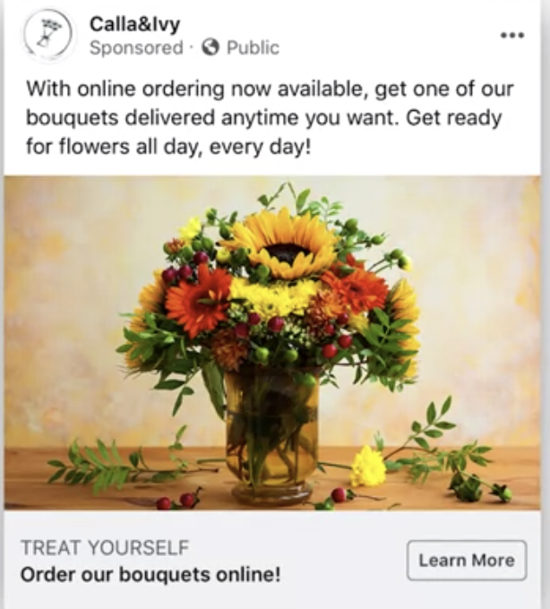

## Measure Your Advertising Effectiveness Overview

> `"Half the money I spend on advertising is wasted; the trouble is I don't know which half"`
> John Wanamaker

### What Are Experiments?

- **Experimental Design:**

  - Receive treatment (Treatment Group)
  - Don't receive treatment (Control Group)
  - The one variable that differs between the groups is often referred to as `Treatment variable`

  - You can use experiments to measure the effects of your ads on the results you're hoping to achieve. For example, if one group sees your ads and another group doesn't see your ads, you can measure how many results or sales you achieve from the group that saw your ads and compare that to the number of results of sales you see from the group that didn't see your ads. The difference in results or sales can then be considered the result of your advertising. But as I'm sure you can imagine, creating a controlled experiment to measure your advertising effects is a bit more complex than comparing what happens to two identical plants when you give one of them fertilizer. In the next video, we'll go through exactly how these experiments are set up. But before we do that, there's one really important thing you should remember about experiments.

- **Experiments need careful planning.**

### Using Experiments to Measure Advertising Effectiveness

- **Randomization:-** Process of assigning people to different groups by chance, or randomly.
- **Randomized Controlled Trial (RCT):-** Study design that randomly assigns participants into a treatment or a control group.
- Indentify the target audience
- Randomly assign them to either Test Group or Control Group
- People assign to Test Group are exposed to Treatment, they may see Ad.
- People in Control Group don't see the Ad.
- After the Campaign run, you can compare the Result on Treatment Group and the Control Group.
- In this case, you can look at the difference in conversions or sales of the fall bouquets in the test group-- the group that saw the ads, compared to the control group-- the group that didn't see the ad.

- If there are significantly more conversions or sales from the test group than the control group, we can confidently say that the advertising campaign worked and had a real impact.

- Any difference between the groups is likely to have been caused by the ad or campaign. This is also referred to as the `campaign's incremental impact`.

- **Intention To Treat (ITT):-** Keeps all experiment participants in the group they were originally assigned to, regardless of what they see or do.
- This minimizes the effect of potential bias.
- Let's talk about ITT with an example. Imagine the medical community is testing a new drug and you're placed in the test group you're given the drug to take. But the people conducting the experiment can't always control whether you actually take it. You may forget, or you may decide that you don't want to take it.
- In a ITT setting however, your outcome will be measured as part of the test group, regardless of whether you actually took the medicine or not. It's the same in advertising. Whether or not you actually receive the treatment, you will remain in the test group, and your result will be part of the test group. When you use intention to treat, it reduces the effect of the treatment, which makes it a bit harder to achieve significant results. But it keeps bias out.

- **Good Expeeiment:-**

1. Randomized Controlled Trial (RCT)
2. Uses Intention To Treat (ITT)

![Introduction to Advertising Effectiveness Measurements Practice Quiz] (https://www.coursera.org/learn/measure-and-optimize-social-media-marketing-campaigns/quiz/4xmOG/introduction-to-advertising-effectiveness-measurements-practice-quiz)

## Measuring Advertising Effectiveness on Facebook

#### Experiments to Measure Ad Effectiveness on Facebook

- **RCT Tests on Facebook:**

  1. Holdout tests

     - Measure conversion lift (Action)
     - Test Group: - called `Holdout Test`. See the Ad.
     - Control Group. Didn't see the Ad
     - Conversions: `Sales, adding a product to a cart, downloading an app or more`

     1. **Actions on website** -> you need to put the information onto `Facebook Pixel`
     2. **Actions in an app:** pass back the data to `Facebook SDK`. The Facebook SDK is a special software developer kit Facebook provides to mobile developers for exactly this purpose.

     3. **Actions offline**: like a sale in a store, for instance, data needs to be provided through a `Conversions API`. A conversions API involves connecting data from a system that monitors offline sales to Facebook's system.

     - `The final step in your holdout test is measuring the results and comparing the difference between the groups. This means you're comparing the actions you see in the control group versus the test group. The lift in conversions you see between the test and control group can be attributed to the ads. That lift is the effect of your advertising. `

  2. Brand Survey tests

     - Measure brand lift (Attitude)
     - Brand lift refers to an increase in the awareness for a brand. or Consideration
     - Test Group: expose to the ad.
     - Control Group: do't see the ad.
     - All the people that were part of your test group and the people in your control group will be served one or a few polling questions.
     - The main question people will be asked is: `do you recall seeing an ad for this brand online or on a mobile device in the last two days?` Y or N
     - Next, you'll measure the difference between the ad recall in the test group versus the control group.
     - The effect you're seeing on brand recall is caused by the ad.

     - `Your campaign goals will determine whether you should perform a holdout test or a brand survey test.`

- Example
- `CALLA & IVY`
  
- Imra would like to sell more of her flower bouquets online, but she also realizes that not too many people know about the option to order flowers through her website, so she decides to run a campaign to generate more awareness of her brand, and the fact that you can order online from her website.
- She uses ads with beautiful images of the bouquets and a headline that reads, treat yourself, order our bouquets online. She adds a learn more call to action button.
- This campaign aligns with the top part of the purchase funnel. At the awareness stage.
- Imra wants people to learn about the brand and the online sales options. Imra wants to understand what the effect is of this campaign.
- Before running the campaign, she decides that she will conduct a `brand survey test` to evaluate the effect.
- Out of Imra's target audience a group of people is randomly assigned to a control group. This group won't see Imra's ad.
- After the campaign runs for about a month, a survey is shown to people in `Imra's test group`, who did have an opportunity to see the ad and her control group, people who didn't.
- Imra chooses to ask the following two questions.
  - `Do you recall seeing an ad for Calla and Ivy online or on a mobile device in the last two days` and
  - `how familiar are you with Calla and Ivy?`
- After the test is complete, Imra learns that her campaign was responsible for a `12 point lift in ad recall`, and `7 point lift in familiarity`.
- Imra is excited about those results.
- Next, Imra plans to run a campaign with the goal to `generate sales` during the fall. She specifically wants to sell the flower bouquets that are very popular in a `physical store in Amsterdam`. For this campaign, Imra creates `carousel ads` with images of the different bouquets, and she adds a call to action button that says `shop now`.
- This campaign is focused on `conversions` and thus fits in the `lower part of the conversion funnel`.
- On the Calla and Ivy website, Imra has implemented the Facebook pixel because there's a pixel event associated with the checkout, when people buy something on her website, data gets sent back to Facebook to signal a conversion.
- Imra wants to keep testing the impact of her campaign's so before starting the campaign she decides to do a `holdout test`.
- Imra targets her campaign to people that have `visited her website in the past`. Of this target audience a group of people will randomly be assigned to a holdout or control group. Another group is assigned to the test group. The control group doesn't see Imra's ads, whereas the test group has an opportunity to see the ad.
- After the campaign stops running, Imra gets the results. There's a `13 percentage` point lift in conversions for people who have seen the ad and Imra decides that's a good result.
- This brings us to our last question for this video. Once the results of your experiments are in, whether it's the results of your holdout test or brand survey. `How should you use that data?`
- There are `two main reasons` why you should conduct these types of tests.
- First, you can use them to prove your advertising dollars were well-spent. As we talked about in a previous lesson, as a marketer, you'll often be asked to prove that your ads had an effect, so you can use these tests to answer that question.
- The `second reason `to use these tests is to further `optimize your advertising spending`. Once you know what the effect is of your ad campaign, you will have more information to make future spend decisions. You can, for instance, decide to shift more of the budget to the campaigns that prove effective, or you can create similar campaigns in the future.

* **Using Results of Experiments**
  1. Prove advertising effectiveness
  2. Optimize your advertising spend.

### Creating a Brand Survey Test and a Holdout Test

- CALLA & IVY
- She run two campaigns:
- Awareness - `Brand Survey Test`
- Increase Sales - `Holdout Test`
- **SMART Goal** Increase awareness of the Calla & Ivy online purchase option with 10 percentage points among the target audience by November.
- `Brand Survey`: Using the Facebook `Experiments` in the Ad Manager.
- After your click Test, you will land on the Facebook experiments page.
- You'll find `Brand Survey`
- **To Be Eligible You Should:**
  1. Have a certain level of money spent in your account
  2. At least spend about $30,000 on advertising
- **Brand Survey:**

  - `Test Details`
    - What would you like to test?
      [] Account
      [] Campaign Group
      [-] Campaign
    - Page: Select the name of the FB pange.`callaandivy`
    - Region: N. America
    - Vertical:
    - Schedule:
      - Start
      - End
    - Test Name: `Awareness Brand Survey Test`
  - `Poll Questions`
    - Poll Language:
    - Poll Question Type:
    - Poll Question 1
      - Do you recall seeing an ad for Calla&ivy online or a mobile device in the last 2 days?
        [] Yes
        [] No
        [] Not Sure
    - Poll Question 1
      - How familar are you with Calla&ivy?
  - You can add `Conversion Events`
  - `Estimated Test Power`
    - The power of a test depends on the questions you use and the time frame in which your test runs. If you're test runs for a long time, you'll get more responses and your results will just be more reliable.

- **SMART goal:** Increase the online sales of flower bouquests during the month of Nov. with 15 points compared to Sept.
- `Holdout Test:`

  - Choose `Holdout Test` from Ad manager
  - `Test Details`

    - What would you like to test?
      [] Account
      [] Campaign Group
      [-] Campaign

  - Schedule:
    - Start
    - End
  - Test Name: `Increase Sales Holdout Test`
  - Conversion Events:
    - Facebook Pixel Event `Initiate Checkout`
  - `Estimated Test Power`

### Interpreting the Results of Brand Surveys and Holdout Tests

- **Lift Results**

  - Band Lift: 1.29M : `the total brand lift or the estimated number of people that are likely to respond favorably to your brand as a result of your advertising.`
  - Cost Per Brand Lift: $0.15: `how much it costs you in advertising spent for each additional person who gives a desired response.`
  - Brand Lift Percent: 13.9pts: `the percentage of people in the test group who recalled your ad was 13.9 points higher than the percentage of people that recalled the ad in the control group. This number is calculated by subtracting the percentage of desired responses observed between the test group and the control group.`
  - In this case, that's 21.8 minus 7.9 percent.

  - Facebook lets you compare the results of your brand survey tests, to other tests in your region, for instance, other tests conducted in North America. This helps you evaluate how strong your results are as compared to average results seen in other tests.

  - The test results also tell you what the confidence level is for your results. In this case, the confidence level is 99.9 percent. This means that if you were to run this test again, there's a 99.9 percent chance that your results will be the same. A confidence level of 90 percent or higher is good. Ideally, you shouldn't go below that. That means your test isn't as strong as it could be. If the confidence level for your test isn't very high, you might want to try to run your test for a bit longer. You may also need to increase your advertising budget to see a bigger effect.

  - **Increase Test Confident Level:**
    - Increase test period
    - Icrease ad budget
    - Choose desired actions higher in the purcahse funnel

- **Lift Results**
  - Cnversion Lift Percent: 65.5% : `gives you the difference in conversions between the people who did and did not have the opportunity to see your ad during this test.`
  - Conversion Lift: 129K: `tells you how many additional conversions happened as a result of your ads.`
  - Sales Lift: $864K: `tells you how much value was generated from those additional conversions.`
    - Cost Per Conversion Lift: $0.63: `he cost of each additional conversion cost by your ads`
    - ROAS Lift: 10.7x: `an evaluation of your return on ads spent or ROAS.` In this case, you achieved a ROAS of 10.7, which means that for each dollar you spend, you'll generate $10.7 in revenue.

### Connecting data with the Facebook Pixel, SDK and Conversion API

[Connecting data with the Facebook Pixel, SDK and Conversion API](https://www.coursera.org/learn/measure-and-optimize-social-media-marketing-campaigns/supplement/P1Uuh/connecting-data-with-the-facebook-pixel-sdk-and-conversion-api)

[Data and Privacy in Online Advertising](https://www.coursera.org/learn/measure-and-optimize-social-media-marketing-campaigns/supplement/pOeUg/data-and-privacy-in-online-advertising)
