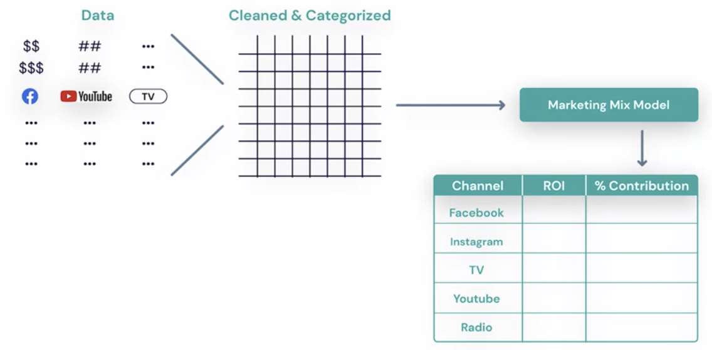

## Optimize Your Ad Campaigns with A/B Testing Overview

- **A/B Testing:-** Process of comparing two variants of an ad angainst each other to evaluate which one performs best.
- You create two versions of Ad: `Version A` and `Version B`
- The one performing well will win the test
- Website designers use it often time.

* **A/B Test Best Practice:-**

  - Vary only one variable at a time
  - Example: ` Imagine I'm running a campaign to sell jewelry.`
  - `Version A`: I have this ad with an image of a ring with a blue stone and a copy of my ad says, `"celebrate memorable moments with a special ring. Check out our new spring collection!"` and I have a call to action button that says `Learn More`.
  - - `Version B`: In this case, I'm going to vary only the image. Instead of a blue stone ring, I'm going to show a ring with `three red stones`. I will keep the ad copy the same, and I will also keep the call to Action Button to say, `Learn More`.
  - Why does this matter? `Well, now when I get my results back and I see that ad B won, I'll learn something from my experiment. I'll know that B won, because the image was better at helping me achieve my results. Since everything else in the ad was the same. I know the image was the reason my results were better. Now I know that under these circumstances this image is best, so I can keep this as my optimal image.`

  - Next time Run another A/B Test using the Vesion having better performance from the above test, with different copies.
  - Version A: `"celebrate memorable moments with a special ring. Check out our new spring collection!"` and the call to action is `Learn More`.

  - Version B: `"Celebrate memorable moments with a special ring. Receive 10% off this week!"`, and the call to action is `Learn More`. This win!

- Next time Run another A/B Test using the Vesion having better performance from the above test, with different copies.
- Version A: `"celebrate memorable moments with a special ring. Check out our new spring collection!"` and the call to action is `Learn More`. This win!

- Version B: `"Celebrate memorable moments with a special ring. Receive 10% off this week!"`, and the call to action is `Shop Now`.

- **So in order to get the most out of your A/B tests, test only one variable at a time.**

### Set Up an A/B Test

- CALLA & IVY
- **Goal** `Increase Traffic`
- After setting up Campain, you then can setup A/B Testing on Facebook Ad manager
- Select the campaign from Ad Manger Dasboard
- Click `A/B` testing
- Create the `B Version`
- Choose `Image` to change it from Version A
- Uplaod the image for Version B
- Give your Test A Name
- Adjust the budget
- The budget will be split 50%, 50% over the two Ad Versions.
- Set the Test schedule
- Key Metric: Cost Per Result
- **Test Power:** The likelihood that a test can detect a difference if there is a difference to detect.
- `To have a good test, the power shoud at least be 8%.`
- \*\*Increase Test Power By:

  - Increasing your budget
  - Increasing the time your ads run for.

- **Variables You can Test:**

  - Creative: like `text, CTA`
  - Audience:
  - Delivery optimization:
  - Placement:

- **Best Practices For A/B Tests:**
  - Test one variable at a time
  - spend adequate budget
  - Run the campaign for 2 weeks or more
  - Use the winner in a next test.

### Interpret Results of an A/B Test

- \*_Two Main Parts to Your Results:-_
  1. The winner
  2. The confidence level

* **Results**
  - Cost Result: A: 39.53, B: $20.07
  - B: the winner.
  - confidence level of 93%. `In other words, there's a 93% chance that B will be the winner if she were to repeat a test with the same settings`

- **Increase Confidence Level:-**

  - Increase budget
  - Increase length of test

- **Next Steps:-**
  1. Shift budget to the winner
  2. Continue testing
  3. Use what you learned in future campaigns

[Optimize within a Campaign with A/B Testing Practice Quiz](https://www.coursera.org/learn/measure-and-optimize-social-media-marketing-campaigns/quiz/S2YUV/optimize-within-a-campaign-with-a-b-testing-practice-quiz/attempt)

# Optimize Advertising Across Channels

### Measuring Across Channels with Media Mix Models

- **Cross Platform Measuremnet:**

  1. Media Mix Modeling
  2. Attribution Modeking

  3. **Media (Marketing) Mix Modeling**
     - Mathematical equation showing statistical relationship between variables and a KPI.
     - In other words, it's an analysis that shows the relationship between the investments you made and the final outcome.
     - Marketing mix models use linear regression, which may ring a bell to some of you.
     - Complex data collection
     - Iterative model building
     -

  

### Measuring Across Channels with Attribution

- **Attribution** The process of assigning credit to touch points along acustomer's conversion path.
- **Attribution Helps TO:**

  - Understand the ROI for diffeternt channels
  - Optimize budgets
  - **Example:-** You are running ads on:
  - ---------------------------Weight ------ROI
  - Google -----------------------30% ------3.5x
  - Google Display Network -------20% ------1.1x
  - Facebook ---------------------20% ------2.4x
  - Tradedoubler -----------------10% ------1.8x
  - Criteo -----------------------20% -----1.1x

- Can include both on-and offline channels
- Can include paid and non-paid marketing
- With attribution modeling, `you choose a model.`

* **Elements of Attribution:**
  - Data
  - `Attribution model`
    - **Rules-Based Models**: You select the rule that determines how touchpoint get credit.
    - **Last Click** Model: a very commonly used one.
      - It give 100% credit to the last click. The last ad the person clicked on, was resposible for that person's decision to purchase.
    - **Last touch** Model: 100% credit to the last click or impression.
    - **Even credit** Model: Even credit to all touchpoints.
    - **Time decay** Model: More credit for recent clicks or impressions.
    - **Positional** Model: First and last touchpoints (clicks or impression) given more credit
    - **First Click** Model: 100% credit to the first click.
    - **First touch** Model: 100% credit to the first click or visit.

- **Statistical Model**: Assigns fractional creadit for a conversion to touchpoints based on their estimated incremental impact.

* **Accuracy Depends on:**

  - Quality of data input
  - Accuracy of the model

* **Example**
* **CALLA & IVY**

- Instagram: awareness creation with Video, image
- Facebook: winner
- `Even Credit` Event credit to all touchpoints

### Challenges When Measuring Across Channels

1. Measure across platforms and devices
   - Facebook Pixel: for facebook
   - Facebook SDK: for app
   - Offline Store: FB Offlline Conversions API
2. Connecting touchpoints to one person
   - you can't identify one person click on one the same ad on mobile and computer
   - Solution: `Unique FacebooK ID. ` Login on your FB via Mobile and Computer are the same.
   - Cookies also offer a solution, but it doesn't work on mobile.

What does Facebook leverage to help solve the challenge of connecting touchpoints to one person?

A persistent login

Correct
Correct! This is one way that Facebook helps connect the dots between touchpoints.

Cookies

The pixel

Correct
Correct! This is one way that Facebook helps connect the dots between touchpoints.

A unique identifier linked to a Facebook account

Correct
Correct! This is one way that Facebook helps connect the dots between touchpoints.
