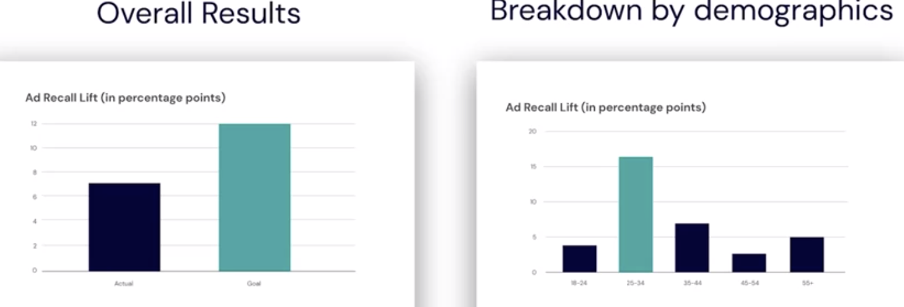
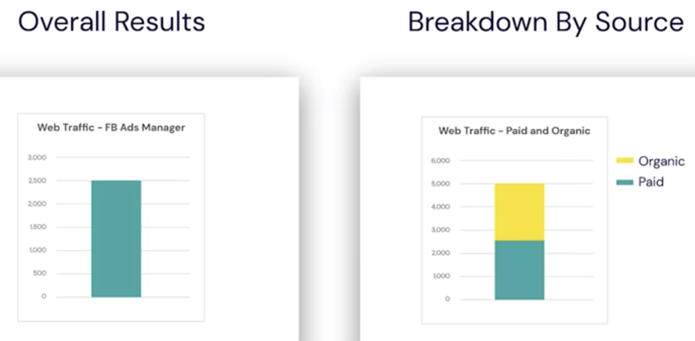
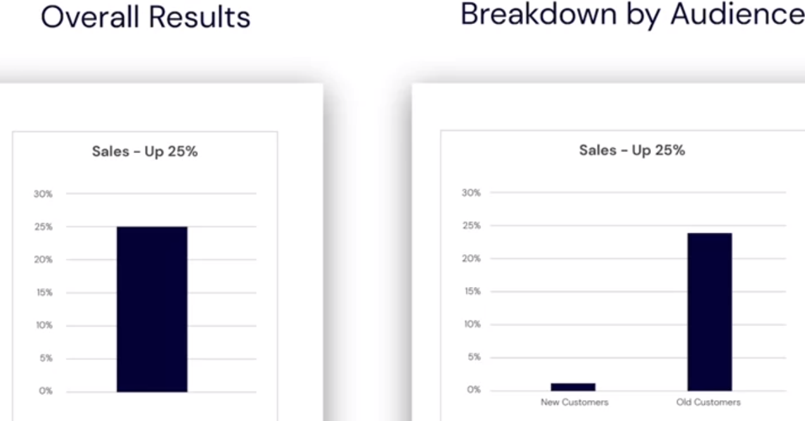
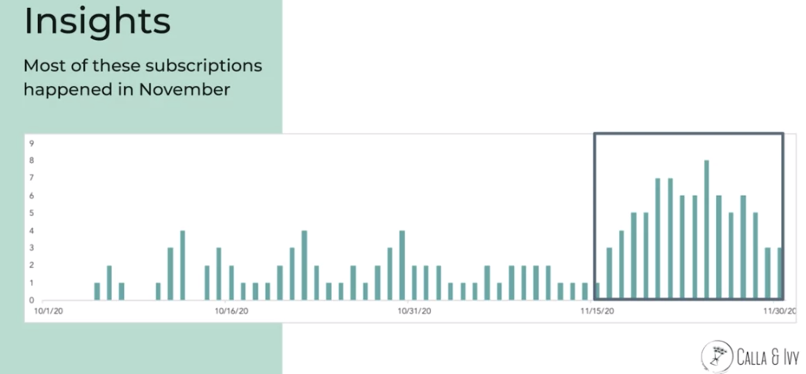
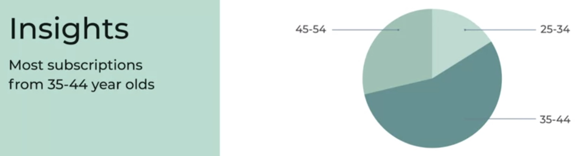
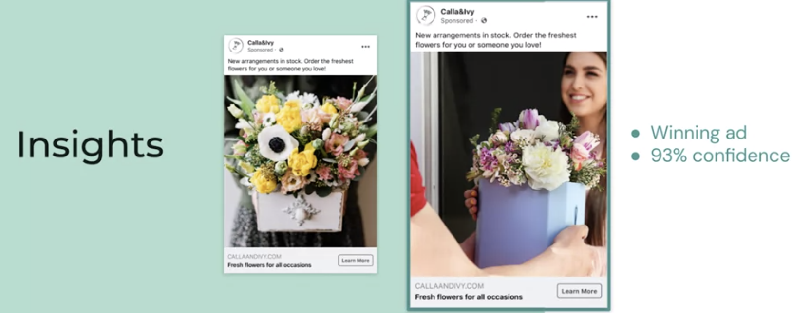

## Presenting Your Campaign Results

- **Your Presentation Should:**
  - Tell a story and give context
  - Show what the data tell you
  - State conclusions and insights
  -
- **Your Story:**
  - `Goal -> Action -> Measure -> Insights -> Goal`
  - `SMART Goal -> Campaign -> Measure -> Insights -> SMART Goal(New Campaign)`
  -
- **Campaign Setup:**
  1. Goals
     - Increase brand awareness by 5 pts over next 3 months
     - Gain 25% more sales in Q2 5,000 new visitors in January.
  2. Campaign Objectives:
     - Awareness
     - Conversion
     - Consideration
  3. KPIs
     - % Ad recall lift
     - Number of conversion events
     - Landing Page Views
- **Campaign Specifics:**

  1. Creative
  2. Audience
  3. Platform
  4. Duration
  5. Budget

- **Campaign Results:**
  1. Data Sources
  2. Metrics Overview
     - Results (KPIs)
     - Cost
     - ROAS (and ROI)
     - Effectiveness
  3. Insights
     - Evaluate your goal
     - Breakdown by segment
     - Apply insights to next steps

## 

--

## Presenting Your Campaign Results (Applied)

- We are going to use google slide
- **Goal:** 200 new subscriptions during October and November
- **Campaign Objective:** Conversions / Purchases
- **KIP:** Number of purchases (tracked via Facebook Pixel)
- **Creative Assets:** Show the pictures of the ads
- **Campaign Settings:**
  - **Objective:** Conversions
  - **Audience:**
    - Age 25-55
    - All genders
    - Located in the Netherlands & Belgium
    - Placement: Facebook & Instagram
    - Duration: October & November
    - Budget: $1,000
- **Results:**

  - `Campaign Result`

    - 150 new subscribers
    - $50/subscriber
    - Revenue = $7,500
    - ROAS = 7.5
    - 150 new subscribers
    - LTV = $300/subscriber (assume they will stay with us for 6 months)
    - Revenue = $45,000
    - ROAS = 45

  - `Campaign Cost`
    - Budget = $1,000

- **Conclusion & Next Steps**

  - Focus on 35 - 44 year olds
  - Concentrate ads in November
  - Use creative with women receiving flowers
  - keep optimizing to reduce conversion costs.

- Thank You!
