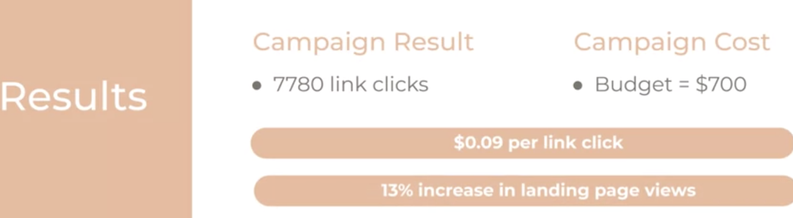
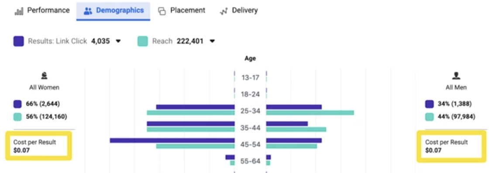

# Presenting with Data

## Telling a Clear Story With Data

- **Data Visualization:-** Presenting data in the form of a chart, digram, picture, etc.

- **Bar or Column Chart:**
  - is a great way to represent data that falls into different categories, like preferences.
  - Number of people who like version A vs version B of an Ad.
- **Pie Chart**
  - A pie chart is a great way to show how a whole is divided into parts.
  - Democraphic Distribution, Age disaggregation,
- **Line Graph**
  - work well to show how numbers chnaged overtime., comparing trends,

* **Tips:**

1. Don't clutter the chart
2. Use color to help the audience focus on what matters.
3. Make comparisons easy
4. Order your data when possible
5. Pay attention to the scale
6. Call out importnat points

### Communicating in a Presentation

- **Best Practices:**
  - Prepare.
  - Use slides only to highlight what you speaking about. You keywords. Font size 28 or bigger
  - Script/notes/memorize - Do't read from your slides. Use note card ...
  - catchy opening. Like Rethoric questions
  - Use a story framework
    - **Story Framework:**
      - Goal
      - Actions (Campaign)
      - Insights (Data)
      - Conclusion and next steps
- Circle back the conclusion
- Q&A at the end.

- **Mitigate Your Nerves:**
  - Anchoring: pausing, taking water
  - Prsctice run time
  - Practice movements
  - Slow down and breathe
  - Eye contact
  - watch the clock
  - Tech and set-up issues
  - See the room beforehand
  -

## Example: MFreshFlowers

- **Goal** Increase basket landing page views by 10% from the first week of November.
- **Campaign Objective:** Traffic
- **KPI:** Link Clicks
- **Creative Asssets** See the video
- **Campaign Settings**: - `Objective`: Traffic - `Audience`: Age 25-64; All genders - Located in South Jakarta - Like flowers, wine and fashion - `Placement`: - Facebook & Instagram - `Duration`: One week - `Budget`: $100/day ($700 for the week) - `Result`: 7,780 Link click, Cost per Result: 0.09

- **Inssights**
- Cost per click is the same for men and women, but women click more

- **Placement**
- **Creative**

- watch again
- **Conclusion & Next steps**
  - Target both men and women
  - Expand the platforms to further optimize the result
  - Use a one image ad
  - keep testing(A/B) to optimize creative
