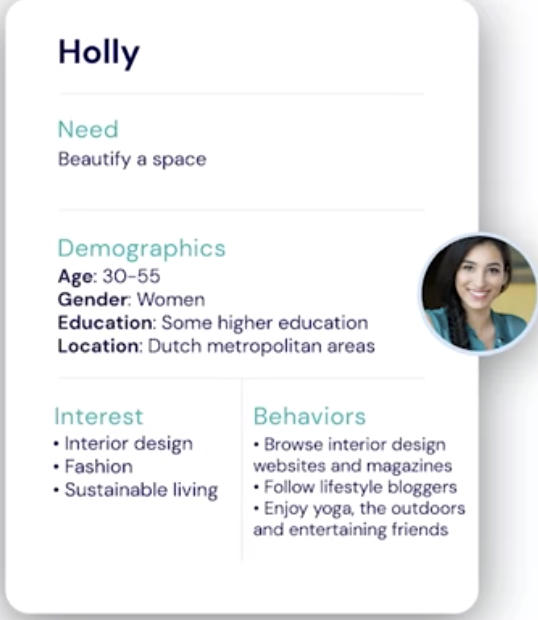
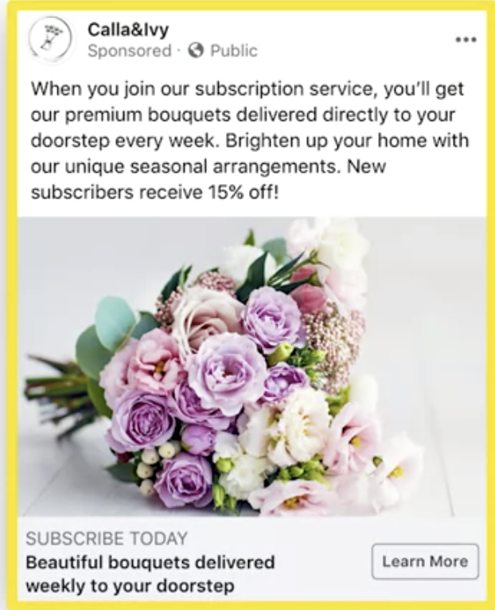

# Creating an Audience in Ads Manager

### Select Your Audience, Placements and Schedule Overview

### Lesson one

1. Introduction to Audiences in Ads Manager
2. The 3 Types of Audiences
3. Core Audiences
4. Custom Audiences
5. Lookalike Audiences
6. Introduction to Facebook Pixel

### Lesson two

1. Choose Ad Placements in Ads Manager
2. Optimization & Spending Controls
3. Schedule Your Ad Set
4. Schedule Your Audience Reach

## Introduction to Audiences in Ads Manager

- Here is the store:
  - Birthday is coming up
  - Teen who love to read
  - you went to booksore to buy her a book
  - the bookstore keeper start asking:
    - How old is she? `She'a sixteen`
    - Where does she live? `She lives outside of New Your City`
    - What does she like to do in her spare time? `She loves to draw`
    - What other books or movies did she enjoy? `She is into stuff like The Hunger Games`

### Ways to Create an Audience:

1. Core audience
2. Custom audience
3. Lookalike audience

## 1. Core audience

- **Demographics:**
  - Age
  - Gender
  - Location
  - Language
  - Educational level
  - Income
  - Relationship status
  - Occupation/Industry
- **Interests:**
  - Music
  - Hobbies
  - Shopping
- **Behaviors:**
  - Purchases
  - Device usage
  - Political affiliation
  - Travel

#### Primary Audience:

- Consider your primary audience to be the audience you connect with the most. It will create organic and paid content with them in mind and they will be the ones buying your product or will hopefully be inticed to buy your product if you run an awareness focused campaign and will spread the message as your biggest fans on social media. And this will be the audience you will use the demographics, interests and behavior filter criteria to capture on ads manager.

#### Secondary Audience:

- Outside those specific audiences

### How can we get these information?

    - Facebook Profile:
    - Democraphy: age, eduction, gender, occupation, the place where you check-in
    - Interest: Interaction within the facebook or Instagram: Thing they share, click, like...
    - Behavior: Facebook Pixe will give you more information.

- **Facebook Pixel:-** A piece of code that you place on your website to track your audience's interaction with your website, app, and Facebook.

[Click Here](www.facebook.com/ads/preferences)

## The 3 Types of Audience

1. Core Audiences
2. Custom Audiences
3. Lookalike Audiences

- We add audience at `ad set` level.
- `Create New Audience`

1. Core Audiences

- Click `Create New Audience`
- First, Pick the `Location where you want to advertize`-Country, city, zipcode..
- Next, set `Age`, Eg. If you target millina, set the age accordingly. `Gender`, Men, Women, All.
- `Languages`, leave if blank if you are not targeting specific language
- `Dail in`: will monitor your audience size.
- `Detailed Target`:
  - Demographics
  - Interests
  - Behavior
  - More Categories
- Facebook Pages
- Apps

2. Custom Audiences

- which allows you to target people who have already interacted with your business in some way and who you want to nurture along their customer journey.
- Under Audience, Click `Create New`
- Choose from two different kinds of data sources:
- `Own Data`

  - Website
  - App activity
  - Customer list
  - Offline activity
  - are from Facebook `Pixel`

- `Data from Facebook`

  - Video
  - Lead form
  - Instagram business profile
  - events
  - Instant Experience
  - Facebook Page
  - Shopping
  - On-Facebook Listings

- `Locations`
- `Age`, `Gender`, `Demographic`, `Interest`, `Behavior`

3. Lookalike Audiences

- audience that is built off an existing custom audience, and looks like your current customers in terms of demographic data, interests, and behaviors.
- First start from `Select Your Lookalike Audience`
- `Select Audience location`
- Select how closely they look like with your Custom Audience. From `Very similar to less similar`

- The broader you go the the bigger the size of your audience.
- You also create mutiple like audience

### 1. Core Audiences

- Created at the `ad set ` level of Ad Manager
- Come after you created `new campaign`
- Either choose `Create New Audience` or `Use Saved Audience`
- For now let go with `Create New Audience`
- Then Choose `Custom Audience` or `Lookalike Audience`
- We will see them later
- For Now let create `Core Audience`
- Core Audience is like this:

- First step, Define the Location: 4 options-> `People Living in or recently in this location`
- In the Search, Type `Amsterdam`
- Then select Milliage or `Current city only`
- Audience size `dial`
- Next, `Age` 25-55
- `Gender`: All
- `Detailed Targeting`: You can Browse or Type: eg. `flowers`. Let choose.
  - Cut flowers
  - Floral design
  - Flower bouquet
- Let go to `Browse` for more features

  - `Demographics->Education->Education Level`
    - College grad
    - Doctorate degree
    - Master's degree
  - Narrow Audience: is another option:
  - Interested in `Flowers`
  - > `Interest`

    - Hobbies > Home and garden
    - Gardening

  - Narrow further
    - `Online shopping`
    -
  - Detailed Targeting Expansion
    - `Connections`: People who like your page
    - Or `Exclude people who like your page` to find new followers.
    - Or `Fiends of people who like your Page`
    - Then `Save` it and `Name it`
    - It will be under `Saved Audience`

## Introduction to Facebook Pixel

- It allows you to track customer behavior to better inform your marketing decisions
- Go to Ad Manager
- Go to `Events Manger`
- Click `Connect a Data Source`
- Choose `Web`
- This initiate `Facebook Pixel`
- `Name Your Pixel`
- NB: Every ad account has `One Pixel`
- `Manually add pixel code to website`:
- OR
- `Use a Partner Integration`: Like Squarespace, wordpress, Shopify, and others

- Once you add Pixel, it will begin collecting data for you.
- Based on that you can build specific audiences

### Event Tracking:

- You need to put a code where the event happened.
- Example payment confirmation.

### Pixel Events:

- Making a purchase
- Adding an item to a shopping cart
- Doing a search
- Submitting a form
- Adding payment information
- Starting checkout process
- Viewing a specific webpage

### Use the Pixel for Retargeting:

### Track Conversions:

### Create Custom Audiences:

- **All those processes go through waht is called Hashing** to keep the data secure.

### CALLA & IVY

- Under `Create a Campaign Objective`
  - Click `conversions`

## Custom Audiences

- contain people have already interacted with in some way with the business.
- You create it at `Ad set` level
- Audience > Create New: `Custom Audienece`
- `Use your source`:
  - website - from the pixel on your web
  - Customer list: you could upload them
  - App activity: pixel for your app
  - Offline activity: information required mannually from customers. Like phone on face to face form filling.
- `Use Facebook Sources`:
  - Video: Peopel who watch the video
  - Lead form: those who fill out the lead form
  - Instagram business profile: People who checkout instagram account
  - Events: those who interacted with your event
  - Instant Experience: people who opened your instant Experience on Facebook or Instagram.
  - Facebook Page: audience who follow or intracted with your pange
  - Shopping: who interacted with your products in a shopping experience on Facebook or Instagram.
  - On-Facebook Listing: create an audinece who interacted with the on_Facebook listings from your catalog

## Let now create Custom Audience for CALLA & IVY from Website.

- Select `Website`
- You will see the Pixel with green
- By default, `All website visitors`
- select `People who visited specific web pages`
- people who `shop X blog X product, `...
- You can also look visitor by time spend on the website.
- Let stick the visitors in the last 30 days
- Click Create Audience
- FB will ask if you want to create a localized audiene

### Now let work with the list:

- `Customer list1`
- `Prepare Your Customer List`
- Include at lease one main i=dentifier
- Value - `NO`
- Now `csv Upload File`
- Click `Next`

* **Let create audienece based on FB source**

- `Vedio`
- `Create a Video Engagement Custom Audience`
- Choose `People who have watched at 50% of your video`
- Now choose the video
- Name the audience and create it
- Location
- Age
- Gender
- Detailed Trageting

## Lookalike Audiences

- In order to create it, you have to have a `Source Audience`
- In Ad Manager, under `New Ad Set`
- Under `Create New Audience` Select `Create New`
- Select `Lookalike Audience`
- `Select Your Lookalike Source`
- `Value-Based Source`
- `Other Sources`
- Let go with `Other Sources`
- You will see `Calla&Ivy` we created and saved last time.
- `Location`: Amserdam or Select Europe
- `Select Audience Size`:
  - Number od lookalike audiences 1
  - Number od lookalike audiences 2
- Click `Create Audience`

- Let create another lookalike audience based on customized audience we have created earlier.
- Create New Audience -> Lookalike audience
- Choose the calla & Ivy video we made last time
- Location
- Size
- Create Audience
- Detailed Audiences
  - Language
  -

# Q -->

What is value-Based Source?

- A source of data that contains value or purchase information on customers.
