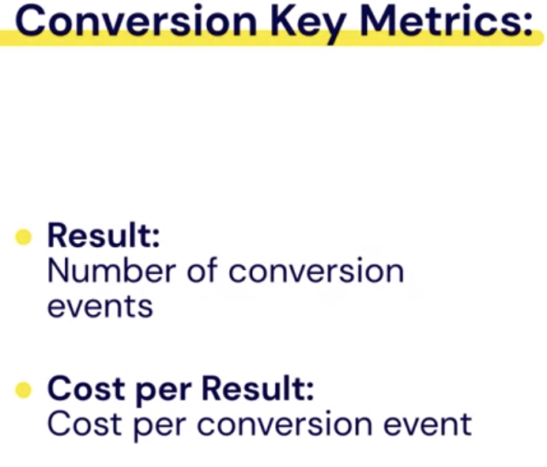

## Understand Your Campaign Performance

- Go to `Campaign` Dashboard
- You will see:
  
  - Delivery
  - `Bid Strategy`: describe the way you want Facebook to bid in the ad auction based on your costs, goals and the optimization event you choose.: Eg `Loewst cost`
  - `Budget`: the max amount you're willing to spant
  - `Result`: # of outcome you have achieved with your campaign.
  - `Reach`: # of people saw your ad at least one.
  - `Impressions`: the # of thim your ad was shown on screen.
- `Cost per Result`: the average amount of cost to achieve your key result. Like getting someone to click a link or buy a product.
- `Amount Spent`: The amount spent column then gives you the estimated total amount of money that you spend on your campaign ad set or ad during its schedule. If your campaign is currently running this metric, may be an estimate since it can take up to 48 hours for metrics to be processed.
- `Ends`:this is where you will find the date your campaign is scheduled to stop running.

- `Results from `2` Campaigns`
- Use `Search and filter` to search for the campaign by name.
- `Filters`:
- `Columns Performance`
-

### Analyze Your Campaign Results

- **Campaign** - `Objective:` Conversions (Catalog Requests) - 2 ad set - Ad set 1:
  Target Audience: Cat owners, aged 20-49, living in the US. - Ad set 2:
  Target Audience: Dog owners, aged 20-49, living in the US. - It was active for about a week:
  [camRes](camRes.png)

* **Campaign Leverl:**

- Campaing Name: Inu + Neko Catalog Requests
- Delivery: Active
- Budget: $300.00 Daily
-

* **Ad Sets Level**
* **Ads**

### How the Campaign Objective Determines Your Key Metrics

- **Results**:- The number of outcomes based on the campaign objective and settings.
- **Cost per Result**: Total amount spent / Total number of results

