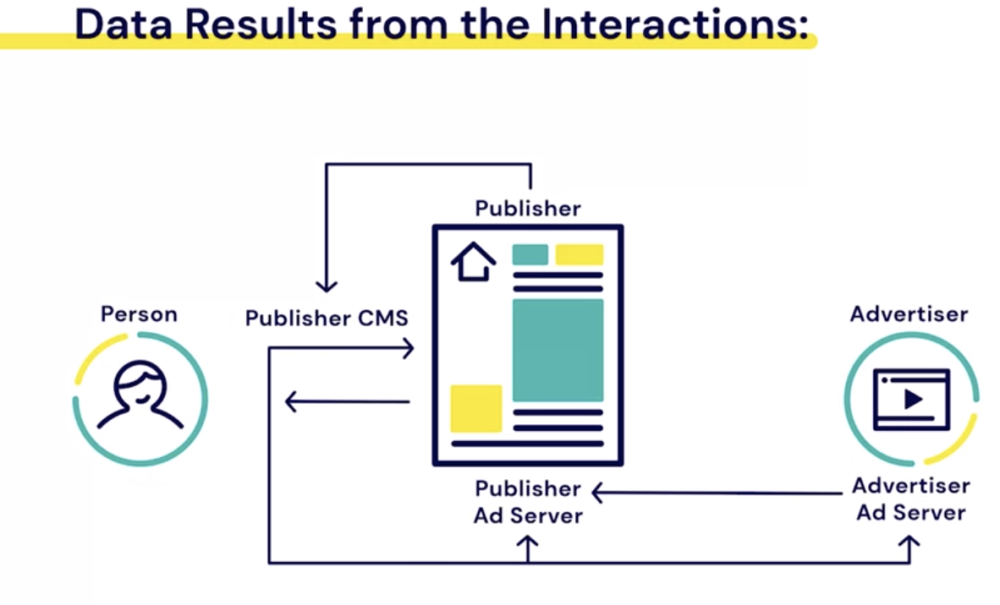

# Data, Privacy and Policies on Social Media

- **Weekly Overview**

1. The role of data in Social Media advertising
2. Data Protection and Regulation

## Data-Based Advertising

- `86%` of time spent online in the US, is spent on advertising supported websites.
- **Data-Based Advertising:** Data-based advertising uses data to optimize it audiences abd creative messaging.

- **Shifs in the Advertising Paradigm:**
- Contextual Advertising
- Data-based Advertising

### Advantages of Data-Based Advertising:

- More likely to interest people
- Can target by demographics, location, interest or previous behavior.
- 500% more effective than ads without data.

### How Data is Collected Online

- Publisher Starts with a Blank Canvas:
- Content is Added
  - Content Management System (CMS)
    - Content
- Ads Are added: - `Ad server`, `Advertising`
- Ads Come from Advertisers:

- **Data Results from the Interactions:** - Person data send to publisher - Publisher CMS - Publisher Ad server - Advertisrer, Ad Server
  

### Different Data Formats

- **Web Server Logs:**
- A server record of the interaction between a person and a website.

1. The user's IP address
2. A unique identifier
3. Username (if applicable)
4. Data and timestamp
5. Content requested
6. HTTP status code
7. Size of content

- **Cookies**
- Website-specific code tored in a person's browser to ease navigation.

- **Cookies Have Limitations**:-
- Don't work across browsers and devices.
- Can be blocked or erased
- Don't work on mobile apps

- **User Identifier (UID)**
- A unique number assigned to someone's account that can be associated with all their logged in behavior.

### Who Collects and Stores Data?

- **First Party**
  - Person <-> First Party
- **Second Party**
  - First Party -> second party
- **Third Party**
  - Collected directely from Person by Publisher or Marketer. Person -> Third Party

Q

Let’s say you buy a smartphone capable dog-caller from the website of a startup partnered with Facebook. The startup then shares your purchase data with only Facebook as part of its funding arrangement. This is an example of:

A
Second-party data
