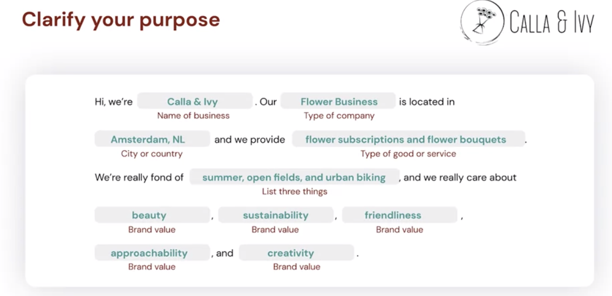
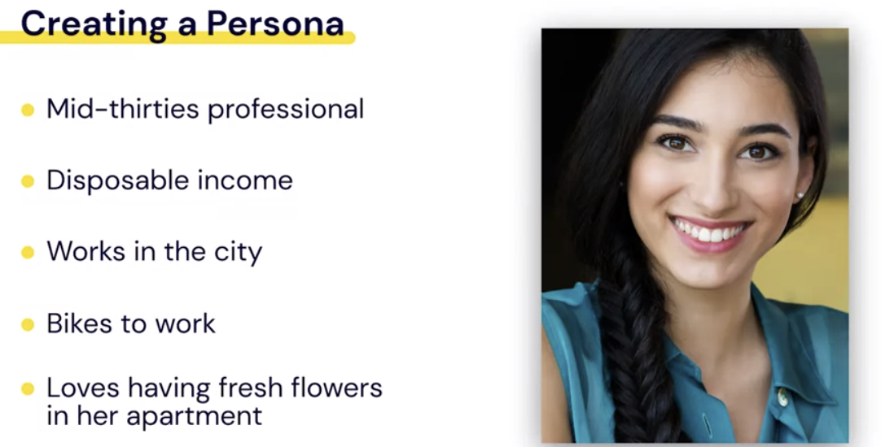
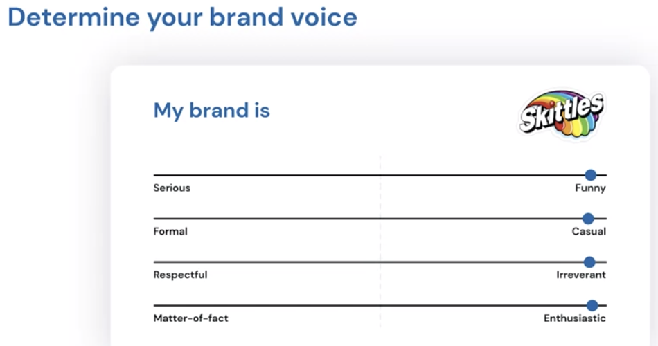

# What Is a Brand and Why You Need One

- **Brand** : - A combination of elements or attributes associated with the business that make up an experience about that business.
- \*\*Brands Consist of:
  - Products or services
  - Feeling at a location
  - Logo, colors, and images
  - Words they use
  - The stories they tell
  - Principles or the values
  - Connection
- **Brand** `"The intangible sum og a product's attributes: its name, packaging, and price, its history, its reputation and the way it's advertised.

  > > David Ogivy

- Creating a brand mean creating an identify or personality for business that differntiate you from your compeitators in the market.

- **Q**
  - Is a brand defined by the business?
  - Is the brand only what consumers perceive or think of a business outside of the business's influence?
- **A**
  - Both

## Function of a Brand (Why you should have a Brand?)

1. Build trust
2. Build connections
3. Enable recognition
4. Ease selection
5. Signaling device
6. Foster loyalty
7. Reduce price sensitivity
8. Facilitates company decision making

# The EPIC Brand Framework

- **E**xistence

  - How the business stated
  - Include business origin history & wht problem the founder trying to solve

- **P**urpose
  - What you do and why you do it, including articulating as set of values for a business
- **I**dentity
  - The visual look and feel from their logo, color palette , images they post.
- **C**onnection
  - How a brand connect with customers .

## Listen to Facebook employee

- Discovery Process:
  1. Explore
  2. Experiment
  3. Release

## Brand: Existence

- Why a business was created
- what problem trying to solve
- who create it

* **orgin Story**

- An account of how a business got strted. It include the people involved and a problem to solve
- eg.
  The story begins in 1995,
  Doug Zell and Emily Munch just wanted fresh roasted coffee, it was really that simple. After moving from San Francisco to Chicago, they found that great tasting coffee in their new city was surprisingly elusive. But instead of complaining or even worse, settling for bad coffee, they hunker down and wrote the original business plan or what would become intelligentsia coffee.
- Let's look at some of the elements of this origin story

1. Founders are named
2. Encountered a problem - No good coffee
3. Solve the problem

- > Storytelling has the ability to create connections, in a way simple facts can't.
- History shows that : when we hear stories, our brains release certain chemicals responsible for empathy and connection.
- There is an element `"I have been their too"`

- Now let create origin story for Calla & Ivy

1. Who launched the business and when?
2. What problem were they trying to solve?
3. How did the business solve it?

`Imra always loved flowers, and as a child would pick them on hikes with her parents an braid them into crowns. But after graduating art school with a degree in design, she was disappointed to see the same bland kind of bouquets being made without any kind of artistic passion or unique design to them. So in 2010, Imra began her own flower shop called Calla & Ivy. In order to offer the unique handcrafted design forward bouquets she knew could bring joy and inspiration to people around her. After a short time, Imra's shop became so popular that she expanded her presence online where customers can order her bouquets digitally and also subscribe for regular flower deliveries. And while her store still exists, Imra uses it to experiment with new ideas. The majority of her sales come from her website.`

## Brand: Purpose

- > `We don't buy what a business does but why they do it`
  > Simon Sinek

- The \*_What and How_
- He saild:
- What:
  `We make computers that are simple and attractive`

-Apple

- `To think differently`

- How and what
- `We think differenlty by making beautifully designed product`

-

- Crearly state your business's purpose, values, and what you stand fr , you'll not only further connect with your audience, you'll further define your audience.
-

- How the business phrase their purpose:
  1. "We believe that..."
  2. Keyword arround ideas or topics you care about
  3. State what your brand isn't
     

## Brand: Identity

- Identity refers to the visual look and feel of the brand.
- This includes the

  - `logo`,
  - the `color palettes` the business chooses.
  - The `aesthetic of the images `to business uses, and
  - even the `typography `they choose.

  #### Logo

  - logo creation combines all the things we've looked at. Origin story, problem solving, purpose, values, and keywords associated with the brand.
  - A logo must also communicate other aspects of the brands like innovation, tradition or whimsy.
  - Finally, what will a logo or a brand be without its signature color.
  - You could probably readily recognize Starbucks signature green color palette. You'd probably readily recognize Facebook's blue as well, and Coke has its signature red label. But what if Coke had a yellow label? It wouldn't be Coke then, would it? Or you wouldn't associate Coca Cola with yellow packaging? What if Coke had blue label? Then, you'd confuse it for Pepsi. Curating a color palette for your brand isn't only about having it be readily recognisable to your customer and differentiating from other products. There's a lot of psychology behind color and color choices, and a color palette can set the tone for your brand as well.

- Red is excitement, blue is trust, orange is fun, brown is natural, and black is prestige.

- here doesn't necessarily need to be deep signs behind the color choices for your brand. Pick a palette that feels right for your business. And use it to influence site design, advertising, packaging and more.

- Finally, typography or the selection of typefaces and fonts that are business chooses helps communicate its visual brand. Like a logo typeface is trying to capture the feeling and association of the brand in lettering.

- Let's get back to Calla and Ivy and help Emma create a visual identity for her business. The good news is that we've already done a lot of work to help us establish a visual identity. In that we wrote her origin story and we articulated to values of her business. First, let's make a logo which captures the bouquets that Imra makes. The lettering in her business name is curved and creative, communicating a kind of friendliness and approachability. Some of the key words that were mentioned under the brand's purpose. Since this is a flower shop, it would make sense to choose a color palette related to flowers or nature. We've chosen soft greens and teals which communicate calm, serenity, and trustworthiness, but also suggests the brands value of sustainability. Finally, we put together some images that will use as guidance for our social media feeds and website design. Some of the images are of Imra's flower creations, highlighting her products and design. One is Imra herself creating a book a showing the artisanal nature of the brand. And the final image is a bouquet being given which communicates the inherent connection created by giving a gift of flowers. Now we can use this visual identity to influence our design, branding, marketing and even everyday business choices going forward. As we went through this lesson brands we didn't mention probably came to mind as you thought about the logos, color palettes, imagery. And maybe even typography of businesses you interact with our daily basis. Continue to take note of visual branding to inform your future branding choices.

## Brand: Connection

- Connection refers to the voice and style your brand adopts in written and verbal communication. Like the visual design choices we looked at earlier, your brand voice is built from understanding your brand story, purpose and values.

- Also, like the visual design choices earlier, choosing your brands voice will help create unique brand identity and literally and figuratively speak to your audience. First, let's define what a brand voice is. Actually, the way I've been speaking to you this whole time is through a deliberately chosen voice. But what if I used a different voice for this course? I could have said, "Hello and welcome to our session on framework overview. Our previous lesson deconstructed and distilled the elements traditionally attributed to brand creation. Yet, as technology continues to evolve, both the form and function required to market in a capitalist economy will alter." Or I could have said, "Hey folks, are you excited to learn about branding? This is going to be awesome, so let's go!" Very different, right, aren't they? You probably figured out from that example the voice of your brand is the way in which your brand speaks the words it uses, and feel it communicates.

- the voice of your brand is the way in which your brand speaks the words it uses, and feel it communicates.
- Should your brand voice be authoritative and confident, friendly and personal, fun and quirky? Would your brand suggest you peruse its website or check it out? Would your brand use short, pithy sentences or long, more stylistic sentences? It comes down to what will resonate with your audience, but how do you know what's going to resonate with your audience? This is where creating a persona for your business comes in handy. Instead of thinking about their audience as a demographic, many businesses create a persona or an example customer. So they can think about one person when they're creating content.

- Let's create a persona for Calla & Ivy. We know who the target audience is, and we could think of the audience as being someone with money to spend on a subscription, who appreciates flowers, who may be interested in sustainability, who probably lives in the city. But see how hard it would be to narrow down a voice. Instead, let's think about Holly, a mid-thirties professional with disposable income who works in the city, bikes to work to save the environment. And loves having fresh flowers in her apartment

On Your own, take some time to write an Instagram caption using three different brand voices:

1. Friendly and positive
2. Traditional and established
3. Young and witty
