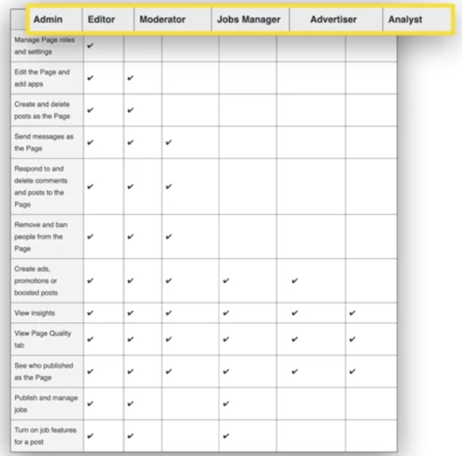
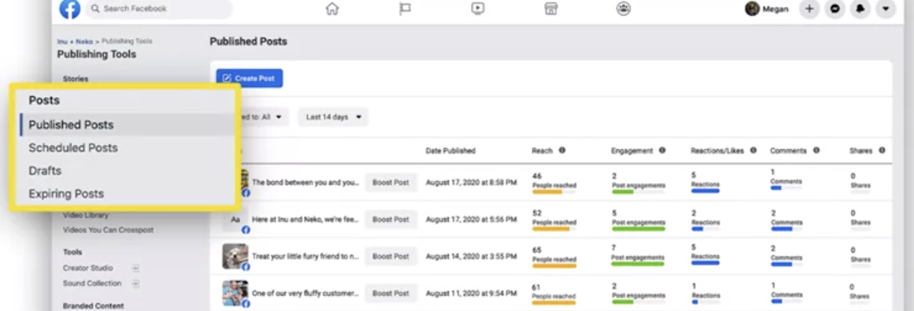

# Managing Your Content and Iteracting with your Following

## Building a Following on Social Media

- **Five Steps to Build a Following**

1. Invite Facebook friends to follow your business page
2. Post valuable content
3. Use #hashtags and @mentions
4. Hire social media influencers

### Social Media Influencers

    - People who have large followings and will advertise your business for you. They start at a minimum of 2000 followers and usually charge for their services.

5. Create an advertising campaign

## Interacting and Moderating on Social Media

- **Engagement Strategies to Maximize Good Branding:**

1. Respond within 24 hours
2. Reply to positive feedback
3. Be polite to negative feedback in Diplomatic way
4. Move issues out of public

### Dealing with Criticism

1. Acknowledge
2. Apologize (if appropriate)
3. Solve in a private conversation

## Managing Your Social Media Presence

- **Managing Social Media Possts**

* Work as a team
  
* Automate responses

  - Response Bolt -4 functions

  1.  Schedule interactions
  2.  Triage customer queries
  3.  Answer commonly-asked questions
  4.  Respond when your business is closed

* Use publishing tools
  

* Commonly used tools are Hootsuite, Sprout, Social and Buffer, for instance. These tools let you connect your social media accounts and then you can create, schedule and manage your posts all from their tool. You can create a post and publish it on all your platforms at once.
* You can also create and manage your content calendar from these tools and keep a nice overview of all your content and activity.
* They also make it possible to keep track of all the ongoing conversations and messages you are receiving and you can respond straight from the tool.

* These tools typically come at an extra cost, but it may be well worth it if you manage more than one social media platform.
