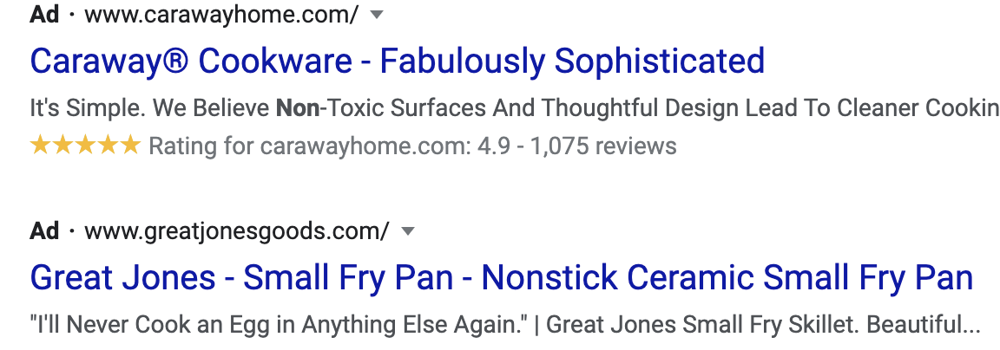
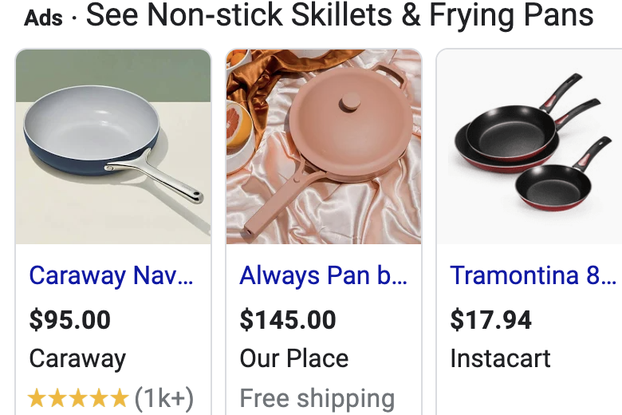
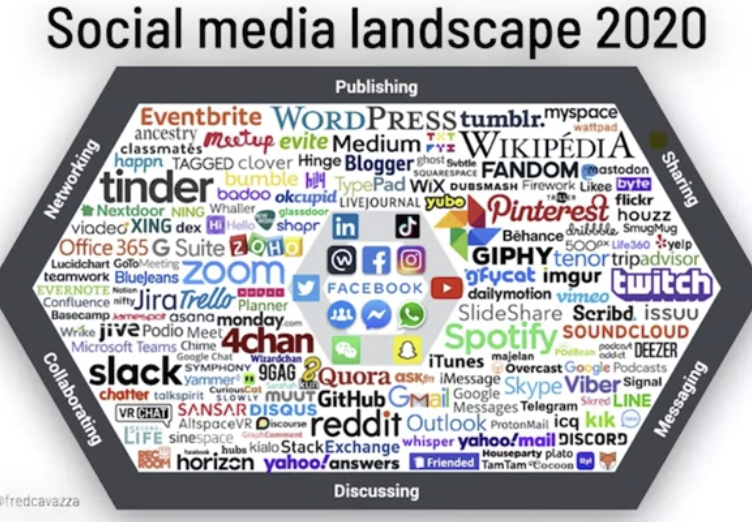

# Introduction to Social Media Marketing

## Introduction to Marketing

- **Marketing**
- Marketing is the activity, set of institutions, and processes for creating, communicating, delivering, and exchanging offerings that have value for customers, clients, partners, and society at large.

- The most take away from this definition is **Offerings that have values**
- It has 4 core steps:

1.  Audience research
2.  Create messages
3.  Get messages in front of audience
4.  Evaluate and optimize impact

- Example
- Imagine you have a company that make soap

1.  Audience research

- what are my customers to buy my soap?

2.  Create messages

- Message1: Natural Products
- Message2: Family Recipe

3.  Get messages in front of audience

- How to get your ads in front of your customers? May facebook or Blog

4.  Evaluate and optimize impact

- Then evaluate it if they have effect on sale.

- **Traditional Marketing**:- Television, radio, billboards, magazines, and newspapers which are the popular channels.
- **Digital Marketing**:- Television, radio, billboards, magazines, and newspapers are all popular channels.

# Introduction to Digital Marketing

- **Digital marketing** is marketing that uses digital technology or digital media.
- Digital marketing allows you to:
  - Target your message
  - Measure your result
- Eg. Cat Food Ads
- Target
  - By using digital marketing, eg Facebook, you can reach or target individual who own cats, but you can't by using TV
- Measure
  - You can measure the behavior of the people who saw your ads or cat food on digital media.

* A lot of what you learn in this course centers around these two key strengths of digital marketing: **targeting** who sees your message and the ability to **measure** the effectiveness of your messages.

## Forms of Digital Marketing

1. Social Media Marketing
   - or marketing in social media channels, like Facebook, Instagram, Twitter, and so on.
   - how marketers can use social media to connect to people online.
   - How you can build up and engage an audience,
   - Examples of social media marketing you may encounter include this Instagram account of Starbucks for instance, where they carefully curate posts for their followers,
2. Search Engine Optimization (SEO and SEM):-

   - is another form of digital marketing is search engine optimization and search engine marketing, or SEO and SEM.
   - Search engine marketers focus on making businesses and their products and services discoverable through search engines like Google.
   - **Search engine optimization (SEO)** focuses on increasing the chance that a website shows up as an organic search result when relevant keywords are typed into the search engine.
   - **Organic search results**:- are the results a search engine returns without anyone paying to have the results come up. OR Search Results not paid for
     

   - **Search engine marketing (SEM)** or advertising, on the other hand, is focused on `advertising associated with certain keywords`.
     

3. Display Advertising
4. Email marketing
5. Content Marketing : - focus on informational or educational

=> Are the most common forms of Digital Marketing

# Introduction to Social Media Marketing

- 3.8 billion users
- 2 hours 24 min time spent per day
- 16-24 yo -spend close to 3 hours a day
- $83 billion spent on social media advertising in 2020

- **Social media marketing** is a form of digital marketing that uses social networking platforms or websites to promote a product or service.

- There are **two** core elements that typically defined social media platforms.

  - They let people

  1. **connect**
  2. **create or share content**.

- There are different types of social networks. Some are more focused on connecting, and others on content creation.
- Some target broad audiences and some are more focused on niches or interest groups.

- Fred Cavazza divided up the landscape in few categories. In this overview, he categorizes the social media platforms in:

  - networking,
    - there are the networking sites and apps. Some of those are focused on professional networking, like LinkedIn for instance. Others are focused on networking around interests like house for Building and design, or around location like nextdoor.
  - publishing,
    - like YouTube or blogging platforms like Medium or WordPress,
  - sharing,

    - Instagram, Pinterest and photo site Flickr are focused on sharing

  - messaging,
    - messaging platforms like WhatsApp, or the more visual platforms like Snapchat.
  - discussing,
    - Sites like Reddit and Quora, can be classified as discussion or Q&A platforms.
  - collaborating platforms.
    - often used inside organizations like Workplace or Slack

- Social media marketing is often split in **two different categories**
  1. Organic or free social media marketing and
  2. Paid social media marketing, also called social media advertising.

1. Organic or free social media marketing
   - refers to all social media activity that businesses can engage in without paying a fee. It's an important part of marketing as social media users have come to expect that their favorite brands, or the businesses they interact with are present on social media.
   - it involves
     - **Establish business profile** or a business presence in the social media channels that matter to users.
     - For instance, setting up a Facebook business page, or an Instagram account for business.
     - **Engaging with users on social media to post** tweets, comments, sharing and so on.
     - **Connecting with customers through messaging** platforms like WhatsApp, for instance, often used for more individual customer service.
2. Paid social media marketing, also called social media advertising.

   - refers to promoting a business' presence or message through:

     - **advertising on social media platforms**. That could be ads on Facebook, or promoted tweets on Twitter, or promoted posts on Instagram and so on.

   - Organic and paid social media marketing go hand in hand. Having a solid, organic social media presence matters to the success of your social media advertising. Ads, on the other hand, can strengthen your organic presence.

- let's look at an example of organic versus paid social marketing first. - Let's take **Staples**, an office supply chain.
- Here is their [Facebook page](https://www.facebook.com/staples), in which they regularly post about new products, provide useful tips and so on. They also have a presence on [Instagram](). Here are a few of their posts, and you can find them on Twitter too.
- Staples posts on these accounts all fall on the organic social media marketing. They don't have to pay to create these pages or these posts, and it's a way for them to interact with their customers and prospects.

- But Staples also uses advertising on social media platforms to reach a broader audience. Here are two examples of ads they ran on Facebook and Instagram. As opposed to their organic social media marketing, these are posts that they did pay for. Social media marketing, let businesses connect with customers and prospects, and it's an excellent way for businesses to share content with their audience. They can do this, through both organic, and paid marketing. In what follows, we'll look at how business participation in social media really works.

## Social Media and Business

- Today more than 140 million businesses use Facebook products every month to find new customers, hire employees, or engage with their communities.
- Companies use social media to learn from their audiences, build loyalty, promote their products, and provide customer service.

- But in order to be successful, businesses have to remember the **two core** aspects of social media.

- Social media lets people **connect** and share or \*_create content_. Participating in social media requires attention to both of these aspects.
- And people have come to expect this connection to businesses and their products and brands.
- companies need connections to their markets to create long-term loyalty.
- To be successful in building a social presence, companies need to understand what type of engagement is prevalent on a given platform, and engage with users in those unique ways.
- To do that, it's a good idea for businesses to take some time to observe and understand the platform and its users, then a business can authentically participate.
- Participation means creating value for your audience, by providing meaningful contributions, you'll be able to expand your following.

- As social media platforms have matured, they've created both free and paid tools for businesses and marketers to reach and engage their audiences. For example, Facebook.com has created dedicated pages for businesses. Facebook business pages enable businesses to have a unique presence online, where they can engage with their audience through posting content, as Facebook feed posts and stories.

- Users on Facebook can engage with businesses through comments, reactions, one-on-one chat through Messenger, and they can share content from businesses with their friends.

- Advertising on social media can help companies to extend the reach of their message, increase traffic to their site, and drive sales. Let's take a look at an ad by Tuft and Needle, an innovative mattress company that has had success with ads on YouTube.

## Social Media and Non-Profits

- You're probably familiar with the ice bucket challenge, the viral campaign from 2014 that had everyone from your neighbor to Arnold Schwarzenegger dumping buckets of ice water over their heads to raise money for ALS research and other charities
- It started with three friends who wanted to cure a debilitating disease. When Pete Frates was diagnosed with ALS, he and his friends wanted to fight a diagnosis and raise money for ALS research. So they turned to Facebook to amplify their reach and get their story out to the world and it worked.
- Ice bucket challenge inspired the 1st generation of Facebook fund raising tools. To date there are 2.4 million ice bucket challenge videos tagged on Facebook and movement continues to raise money today.
- Non-profits like businesses are able to create Facebook pages, events, use Messenger and groups. As well as Instagram accounts for free to connect and engage with their communities.

- Let's take a look at some of these specialized tools. With Facebook's charitable giving tools, non-profits can raise money and awareness for their cause on Facebook an Instagram. These free tools help non-profits collect donations and enable supporters to fundraise for a non-profit. Non-profits using Facebook's payment platform to process donations paying no fee, so 100% of the donations go to the charity. Facebook is not alone in offering special tools and services for non-profits, YouTube's non-profit program for instance, helps non-profits connect with supporters, volunteers and donors. For many causes, video is a new but essential format for storytelling. With one billion viewers on YouTube every month, non-profits of all sizes can use YouTube videos to share their stories and reach a global audience, drive empathy and engage supporters. For example, as part of the YouTube non-profit program, non-profits can set up fundraisers with tools that viewers can use to make donations to an organization or cause right from a video on YouTube. Here is an example of a fundraiser set up by Smosh Games together with St. Judes Children's Hospital to raise money for free care for children and families in need.

- So non-profits have really cracked a code on engaging audiences and turning them into donors through the use of social networks. Let's look at this example from the WWF. They use Snapchat to share pictures of endangered animals, images shared on Snapchat disappeared after they've been viewed, and the WWF cleverly accompanied their image with this hashtag. #lastselfie, they suggested to Snapchat users that they should take a screenshot of the images and share them, so this would not be the animals last selfie. Users share their screenshots on Twitter, Instagram, Facebook and so on. Adding viral strength to this campaign, an raising awareness for the WWF's effort to protect endangered species among the millennial audience. Let's look at a short video about the campaign

- Finally, I would like to mention two organisations that have created tools that help people to tap into the power of social networks to help their cause. One of them is GoFundMe, a platform where people can create a web page for their own fundraiser. They can share this with friends through integrations with social networks like Facebook and Twitter for instance, raising awareness and donations for their cause. Petition website Change.org is another platform that uses the power of social networks to rally people behind causes. Users and organisations can create petitions on the sites that they can share through their social networks. As you can see, social media can be a very powerful channel for non-profits.

- Marketing for non-profits isn't different from marketing in businesses. Marketers work on understanding their audience, creating a powerful message, put that message in front of their audience and then measure and optimize the impact.
