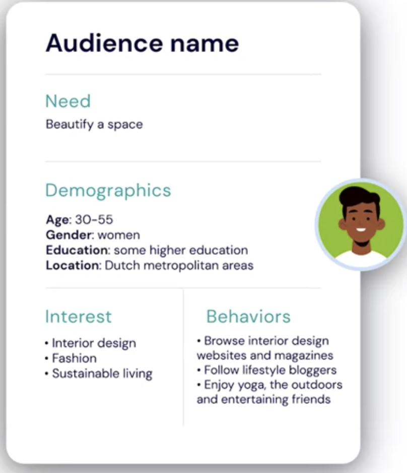
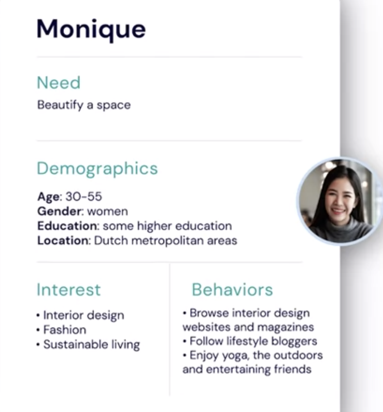
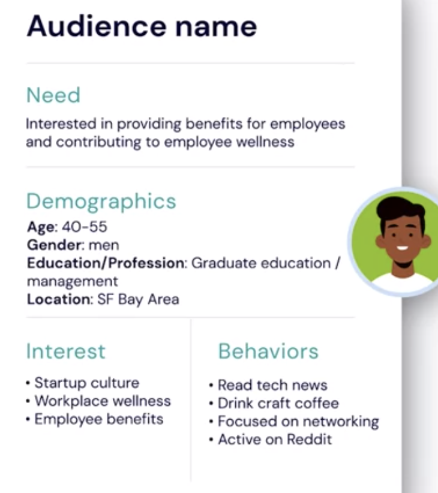

# Defining your Target Audience

- **Your target audience** is a group of people with similar characteristics that you believe will have an interest in your product.

- This template was designed with social media marketing in mind.
  

  - They use name and image that reminds them of all the typical target customer might look like. This type of profile of typical target customer is often referred to as a **target persona**.

- In this example for Calla & Ivy, we could refer to our target persona as **Monique** and we can use this image to refer to her.

- Having a target persona like this with the name and image often helps people in a company when they are communicating within their teams. It helps to make sure everyone can picture who the audience is they are planning to market to. Imra, its Calla & Ivy learned about her target audience through her interactions with customers at her store in Rotterdam

- but what if you don't have store? How do you define your target audience? How do you get to know who they are, what their needs are, their interests, and how they behave? That's where research comes in. Companies will use different types of research to establish a better understanding of their target audience.

- Larger companies may rely on larger qualitative or quantitative studies.

- **Qualitative research** is research that relies on less structures observations. It could be in person interviews, or focus groups, or field research where researchers observe how people interact with their product, for instance.

- **Quantitative studies** are more structured and typically rely on questionnaires or data resulting from the behavior of many people.
- Large companies will often hire research agencies to help them at this study. They will then focus on understanding users of their products, of the competitors product, and how the products fit in their lives.

- But even if you don't work for a large company, or if you don't have the budget to hire a research agency to help you better understand who your target audience is, there are several steps you can take to get a better picture of your target audience.

  - First, start with your current customers. Specifically, those that buy the products or services your marketing efforts are focused on. Think about the characteristics they have in common and brainstorm with your team to describe them, you may even have some sales data to help you. In case you're already active on social media, and you have a company profile or account on some platforms, check out who the audience is that follows you or that likes your brand.
  - Second, monitor your competition. Get a sense of how they communicate an where they are talking, are there particular social channels they are active in? Do they seem to target certain audiences? A bit of exploring to understand their strategy can help you understand the audience they go after and define your own target audience better.
  - And finally, talk to customers, friends, and even strangers that may be interested in your product. Don't be shy, people often like to tell you more about the products and the brands they like.

  ## Another ex:

  - Let's look at one more example, James at DCB Cleaning is working on his social media marketing campaign for Snack Wall. The snack supply service to companies introducing for small and medium sized businesses that already use DCB cleaning services. The goal for James's campaign is to enroll 25% of the DCB cleaning clients in Snack Wall within six months. James is starting to think through the message for his campaign, and he takes a moment to write down the target audience, so he has a clear image of who the message goes to. In terms of demographics, James is targeting an audience that's typically between 40 and 55 years old, mostly male, highly educated, and in a managerial role. The DCB clients are mostly in the San Francisco Bay Area. James is modeling this largely after the current client base of DCB Cleaning since his goal is to attract clients to Snack Wall. To further characterize his target audience in terms of interests and behavior, James sent out a short questionnaire to current customers of DCB cleaning in which he asked them whether or not they were interested in providing free snacks to their team. He also asked questions about the type of business the client was part of. Based on the answers and a client profiles, James had access to, he completed the target audience template as follows. In terms of interests, James believes that his potential clients are interested in startup culture, workplace wellness, and employee benefits. In terms of behavior, he characterizes his audience as reading tech news publications, craft coffee aficionados, and focused on networking. He also found that his target is active on Reddit. James then pictured a fictitious person to represent his target, he added this picture and he called the persona venturing Jim. With this image in mind, James starts to reflect on his campaign and he uses this information to discuss his plans with his intern. It helps them to brainstorm what messages might appeal to venturing Jim. Clearly, defining your target audience is an important step in your marketing preparations. It pays off to take some time to reflect on your target audience. We discussed how research can help you to better define what your target audience looks like, and next you'll find some tips and tools you can use to conduct that research.
    
