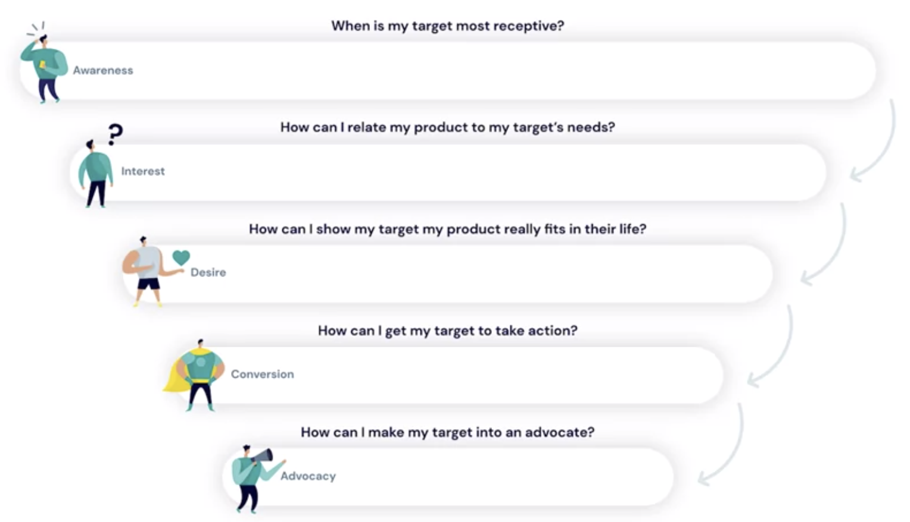
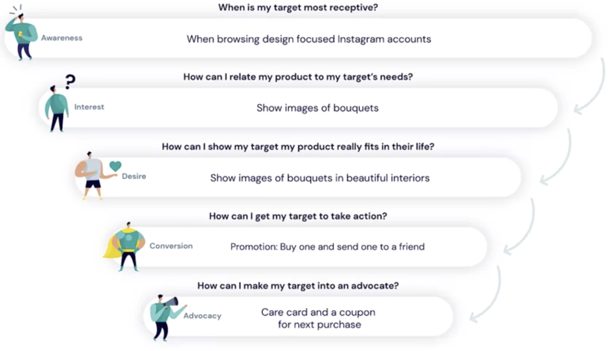

# Mapping your Customer's Journey

- **Customer journey** sometimes called the **buyer's journey**, refers to the experiences people have before deciding to purchase a product or service.

- **Awareness, interest, desire, conversion, and advocacy**.
- Marketing is all about helping people move through this journey so they end up purchasing your product and ideally become advocates.
- To do that, it helps to ask yourself when people might proceed from one stage to the next and how this may happen.

- Let's go back to DCB cleaning, the business cleaning services company.
- Remember James in the marketing department, he's thinking through the marketing campaign that can help current DCB customers become customers of SnackWall. James has determined who his target audience is, their current customers interested in providing benefits for employees and contributing to employee wellness, he also knows that his target audience follows startup related news and is active on Reddit. Now, he's trying to imagine what a typical journey may look like for a targeted customer before they become SnackWall customers and when and how they may move from one stage to the next.

- First, James thinks about the **awareness stage**. He asks himself, when his target will be most receptive to becoming aware of his product and also having an interest it. James believes that it's best to talk about SnackWall a few weeks after a person became a customer of the cleaning service. He figures that by then, customers will understand how the DCB service is different, convenient and personal, and they may be receptive to thinking about a new product they offer. James believes that the best way to introduce SnackWall, is through a message in the DCB cleaning app, which his customers typically open on a weekly basis.
- He also plans to post about SnackWall on the DCB cleaning Facebook page. Then, when a person has seen an initial message, they may be interested but James thinks he needs to do something more to make people really want the service. He wants to prove to them that the snacks are different from the usual office candy, so he thinks a promotion could help.
- He could give people a credit to purchase the snacks in the app. That way, they get to experience what it's like to be a customer of SnackWall, so he plans a 20-dollar credit for each DCB customer to try out the snacks. James believes that this trial, will move many people into the desire stage.
- He would then follow up a few weeks later after people tried to snacks with another offer. A coupon for 20 percent of the first snack delivery. He thinks that this will lead many customers to convert and become a customer of SnackWall. For those people who converted and put a SnackWall in their office, James plans to follow up with a surprise. A box of new fruit bars free of charge. The only thing he will ask for, is that customers follow the SnackWall on Facebook page. He hopes that that will make for loyal customers and real advocates for SnackWall. Of course, different customers may go through different journeys but by mapping what you believe, is a common journey, you have a good starting point to plan your marketing campaign.

- Here is a template you can use to map your customer journey.

You can use this to reflect on what a typical journey could look like for your target audience. For each stage in the customer journey ask yourself, when is my customer ready to move on to the next stage? How can I help them to move forward? Note that the answers to these questions, are really your best guess at this point. Over time, you can adapt the answers as you get more information about your actual customers. Let's go back to Imra at Calla & Ivy. She's working on introducing her website so people can buy her bouquets online. Imra wants to target design conscious women between the ages of 30 and 55 who live in Dutch metropolitan areas. She knows they browse lifestyle blogs and design magazines. Imra knows her bouquets are unique and she believes that they speak for themselves. After design conscious women become aware of her website, Imra believes that images of the bouquets will raise interest among her target group. She believes that if she can show more images of women receiving the bouquets or showing them off in nice interiors for a few weeks after someone becomes aware of Calla & Ivy, women in her target group will start to desire the bouquets. Then she believes a promotion may make people take action and buy a bouquet. She's thinking about a promotion in which you can buy a bouquet and gift one for free to a friend. Imra's bouquets commit instructions on how to best keep them fresh and a thank you card from Calla & Ivy with a coupon for a next purchase. Imra hopes that this extra care after the conversion, will make advocates out of her customers. Mapping the customer journey isn't hard, it's all about putting yourself in the shoes of your target audience.

If you can, use information you have about your targets and your customers. Talk to them about how they decided to buy your product or track the information you have from your existing customers. Don't forget to look back at a journey you described from time to time. As you get more information about your customers, you can adapt the customer journey map. It will help you to fine tune your marketing. Now that you've set your goals, your KPIs, and you've decided who your target audience is and you thought through with their journey, it's time to select the social media channels that will help you get your message in front of your customers. In our next video, we'll take a look at what to consider when you select the social media platforms for your marketing.
